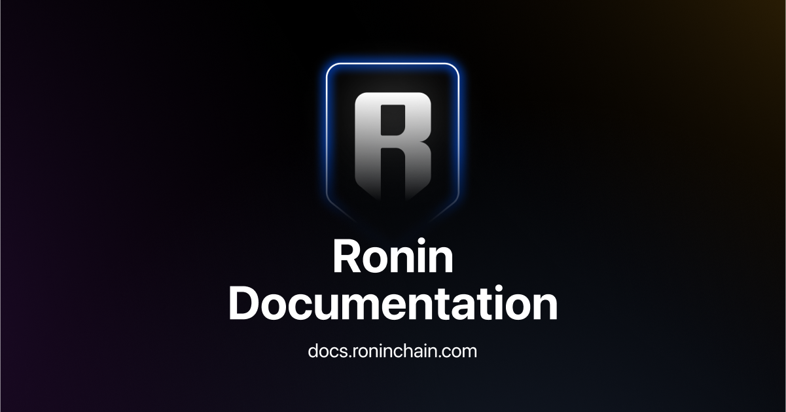

## Ronin chain documentation

This repository contains documentation for the Ronin chain, which is a sidechain of the Ethereum blockchain specifically designed for Axie Infinity. The documentation is available online at
[docs.roninchain.com](https://docs.roninchain.com). The website is built using [Docusaurus](https://docusaurus.io/), a static site generator.

## Local development

To preview changes as you edit the files, you can run a local
development server that serves the Ronin documentation site and reflects the
latest changes.

### Before you start

Install the general dependencies:

* Node.js v18.16 or higher:
  [https://nodejs.org/en/download](https://nodejs.org/en/download)
* Yarn:
  [https://classic.yarnpkg.com/lang/en/docs/install/](https://classic.yarnpkg.com/lang/en/docs/install/)
* Vale:
  [https://vale.sh/docs/vale-cli/installation/](https://vale.sh/docs/vale-cli/installation/)

### Install the project

1. Clone this repository to create its copy on your local computer:

   ```bash
   git clone git@github.com:axieinfinity/ronin-documentation.git
   ```

2. Navigate to the `ronin-documentation` directory:

   ```bash
   cd ronin-documentation
   ```

3. Install the project's dependencies:

   ```bash
   yarn install
   ```

4. Start the local server:

   ```bash
   yarn start
   ```

This command starts a local development server and opens up a browser window at [http://localhost:3000](http://localhost:3000). Most changes are reflected live without having to restart the server.

## Contribute to the documentation

All you need to know about contributing to the docs is available in the
[Contribution guide](https://github.com/axieinfinity/ronin-documentation/blob/main/docs/CONTRIBUTING.md).

## Deploy the project

Documentation deployments are automated. When a pull request (PR) is merged to the `main` branch, it's automatically deployed to production and the status is displayed on the PR's page in GitHub.

## License

This project is licensed under the terms of the [GNU General Public License v3.0](LICENSE.md) license.
