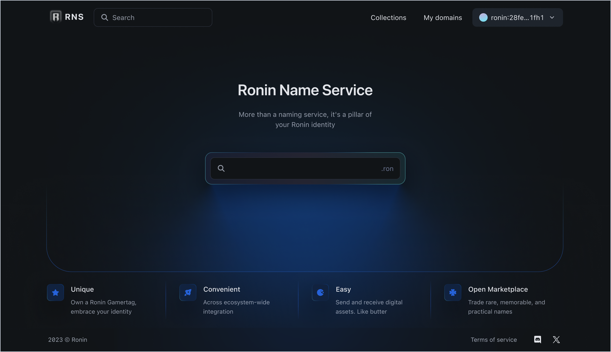
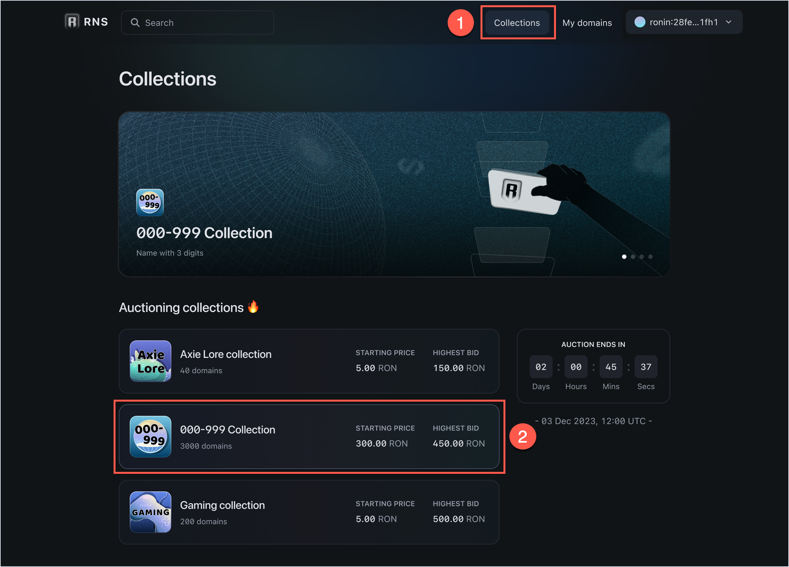
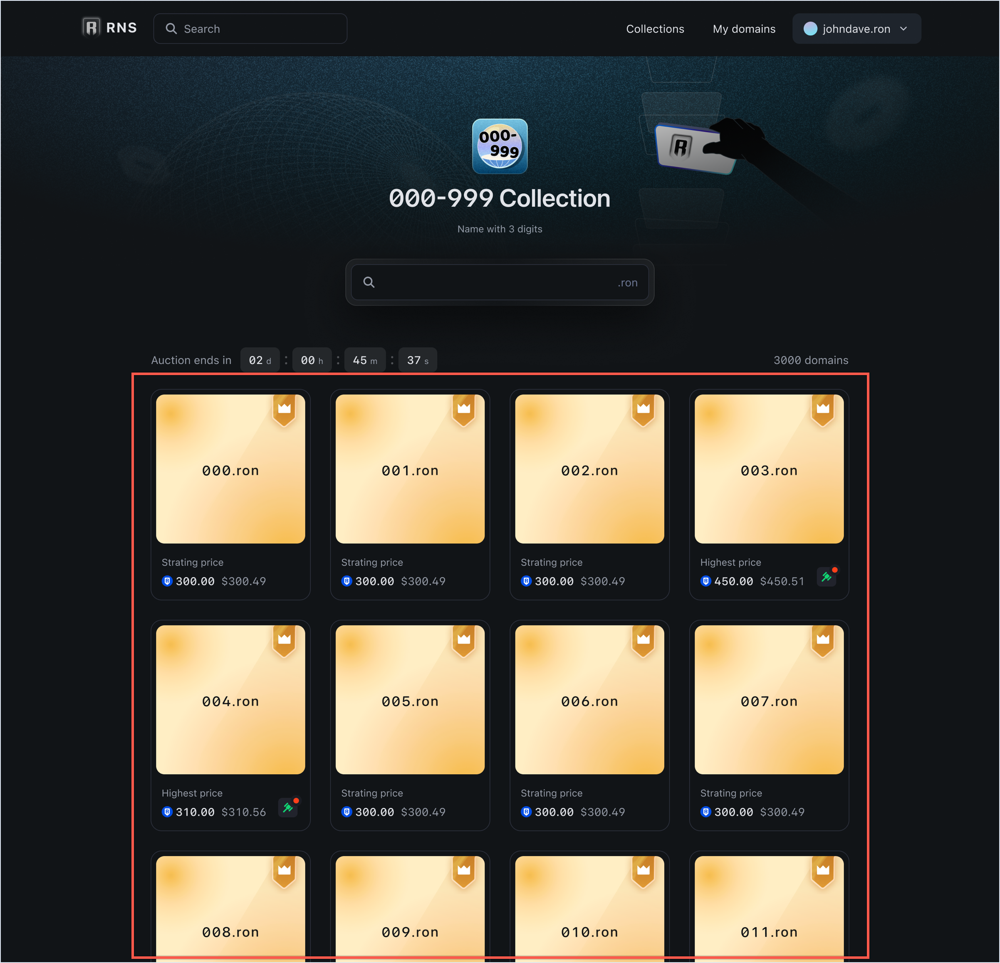
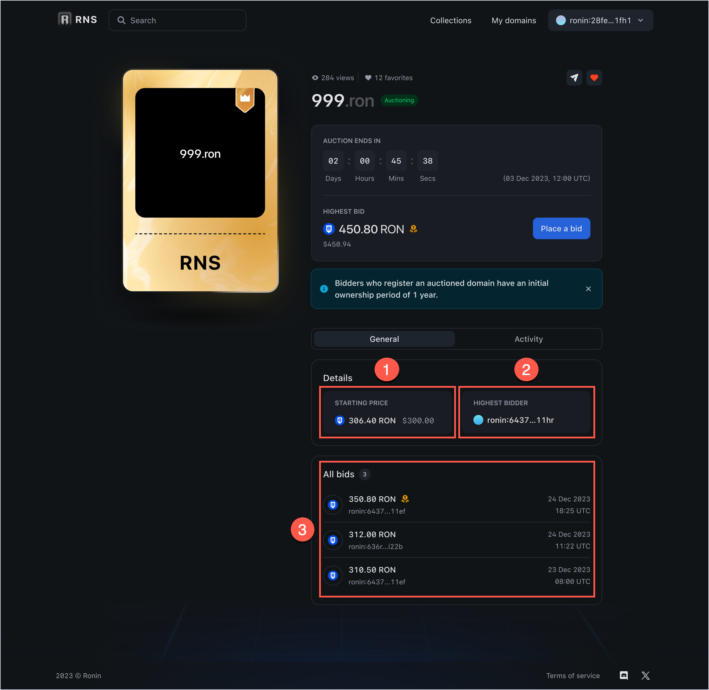
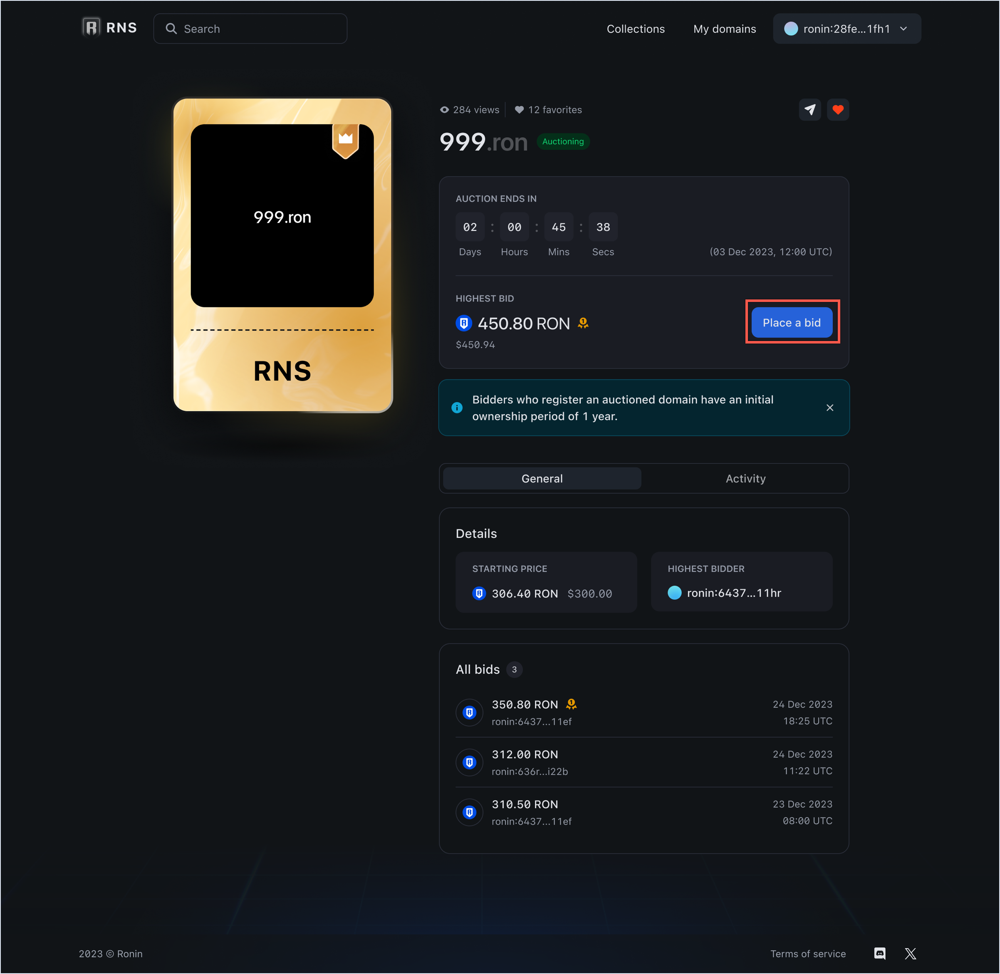
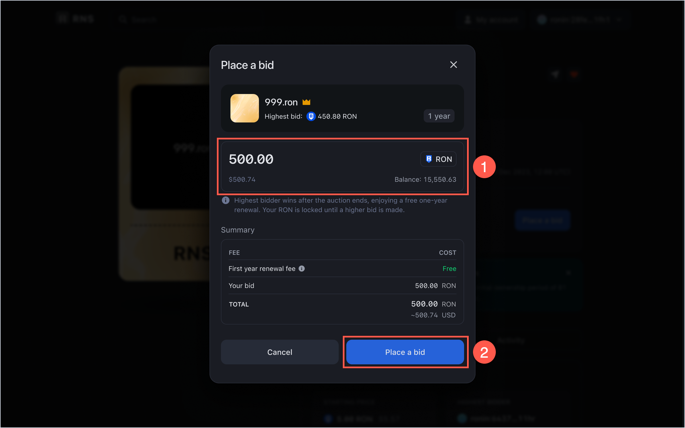
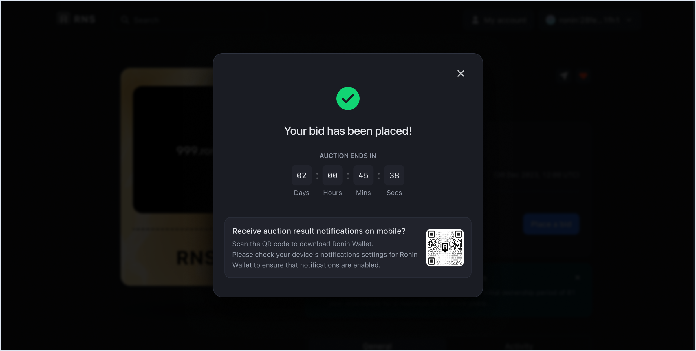
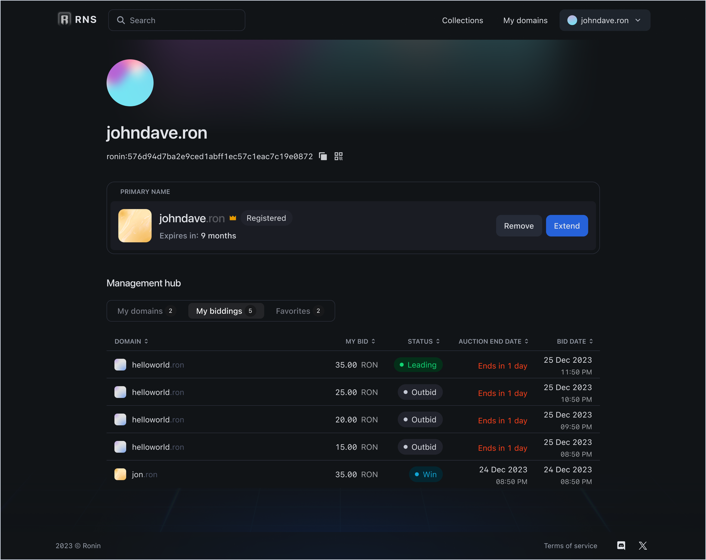

## Overview

This guide shows how to buy a high-value `.ron` name at an auction.

Sky Mavis holds domain auctions for unregistered RNS names that are likely to be highly sought-after, such as `adventure.ron` and `moonshard.ron`.

To take part in a domain auction, participants place bids. If someone outbids you during the auction, your bid is immediately refunded, and you may place another bid.

When the auction ends, the bidder with the highest bid wins. The winning bid is the price of the domain.

The winner receives the domain and is exempt from renewal fees for the first year. After winning the domain, the owner can extend its registration.

In RNS, auctioned domains are listed as follows:

* **Awaiting auction:** Domain name that's in the auctioned list but does not have a scheduled auction in the near future.
* **Upcoming auction:** Domain name that doesn't have a starting price yet but has an announced auction date.
* **Auctioning:** Domain name that's being auctioned and is open for bidding. If no one places a bid during the auction, the domain's status becomes **Awaiting auction** until another auction opens.

### Renewal fee

Following is the annual renewal fee for auctioned RNS names.

| Name length | Renewal fee |
|---|---|
| 5+ characters | $5/year |
| 4 characters | $100/year |
| 3 characters | $300/year |

### Starting price

The starting price of an auctioned domain is calculated in RON. Internally, it's \$5 for five-character names and above, \$100 for four-character names, and \$300 for three-character names. Externally, RNS converts the USD value to RON using the RON [moving average](https://en.wikipedia.org/wiki/Moving_average) price for the last 7 days, by the time auction starts.

## Before you start

Before registering an auctioned domain, install [Ronin Wallet](https://wallet.roninchain.com) and create an account.

## Register an auctioned domain

1. Open the [RNS app](https://id.roninchain.com).

1. Select the **Collections** page (1) and browse the available collections (2).

1. Select the domain you like from any collection to open the domain info page.

   Alternatively, you can enter the domain name in the search field on the home page of the RNS app.
   
1. The info page displays the [starting price](#starting-price) of the domain (1), the current highest bidder (2), and the history of bids (3).

1. Click **Place a bid** to participate in the auction.
   :::info
   How much to bid is up to you, but there's a minimum markup of 10%. This means 10% of the starting price if you're the first bidder or 10% of the highest bid if you're not. For example, if the starting price is 5 RON, then your bid has to be least 5 RON + 10% of 5 RON = 5.5 RON.
   :::
   
1. Enter your bid amount (1) and click **Place a bid** (2) to make payment.

1. Your bid is now placed and locked until the auction ends. To keep track of your bid and the auction in general, download the Ronin Wallet app and enable notifications.

If you win the auction, your bid is transferred to the RNS registrar and you become the owner of the domain name for 1 year.

## Track your biddings

To view your biddings and their status, go to **My account > My biddings**. If the bid is active, then you're the leading bidder. If you're outbid, you lose the auction and the bid is refunded.

## See also

* [Extend your registration](./../../manage.md#extend-your-registration)
