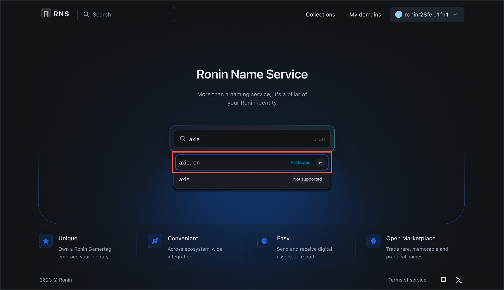
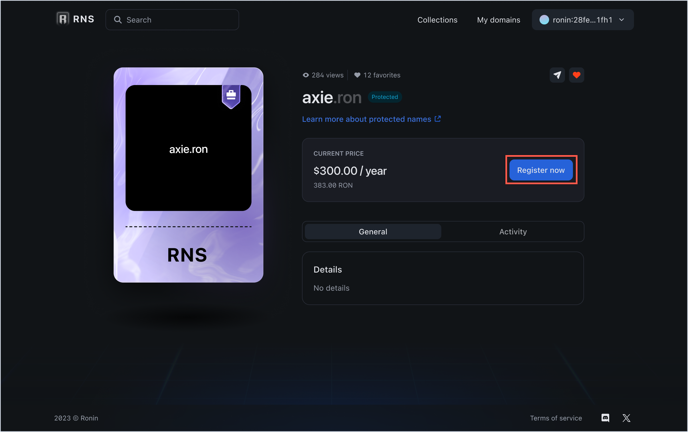
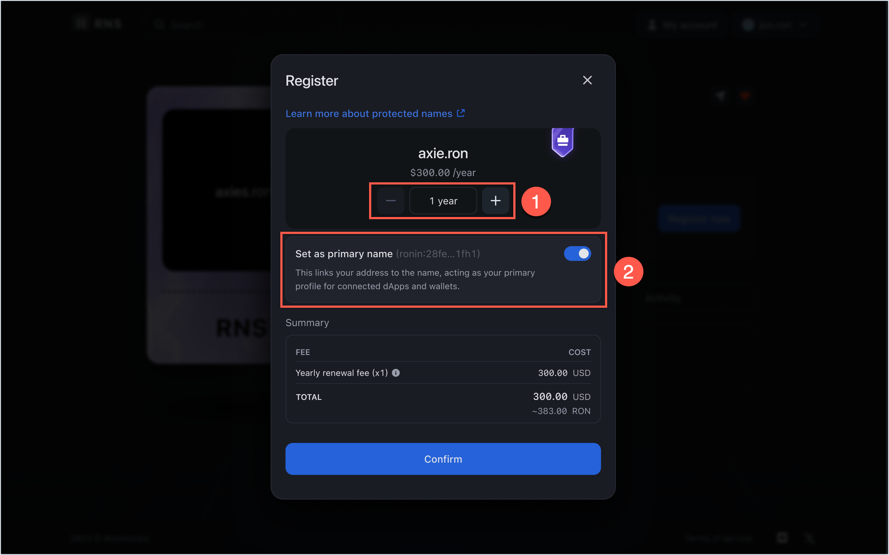
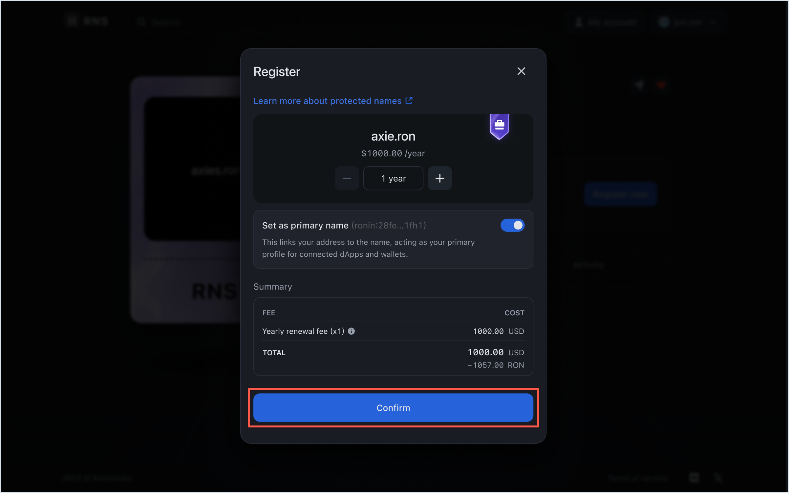
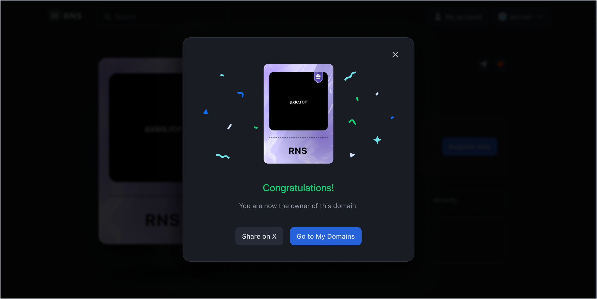

## Overview

This guide shows how to register a protected `.ron` domain name.

Protected names, which are reserved by Sky Mavis for its official partners and key community members, are not available to anyone else. In RNS, these names are listed as **Protected**.

Sky Mavis provides direct support to prevent anyone from squatting or misusing your protected name. Renewal fees for protected RNS names are fixed and not affected by the market.

:::caution
As long as the owner doesn't sell or transfer their RNS name to another wallet, the name and its annual fee are protected. If the name is sold or transferred, it's no longer considered *protected*, but its renewal fee remains unchanged.
:::

## Before you start

Before registering a protected domain, install [Ronin Wallet](https://wallet.roninchain.com) and create an account.

## Register a protected domain

### Verified business

If you are an official partner or key community member of Sky Mavis, we may have reserved your RNS name and mapped it to your Ronin address. To claim the reserved name, follow the steps in this guide.

1. Open the RNS app and connect the Ronin Wallet to which your domain name is mapped.

1. Search for your protected domain name, and then select it to open the domain info page.

1. The info page displays the renewal fee, domain tier, as well as other details. Click **Register now** to begin. The RNS registrar requires one transaction to register a protected name: a registration transaction.

1. Select the duration of your registration period in years (1). The renewal fee changes based on how many years you selected. The minimum duration for the registration is 1 year. Notice that the name is set as primary by default (2), which means that it's displayed as your RNS name in all the RNS-enabled apps.

2. Click **Confirm** and pay the renewal fee to register the domain.

1. After the registration transaction is complete, your RNS domain name is successfully registered.

You can now see your unique RNS name everywhere across the Ronin ecosystem. To view and manage your RNS names, click **Go to My Domains**.

### Non-verified business

## See also

* [Manage RNS names](./../../manage.md)
