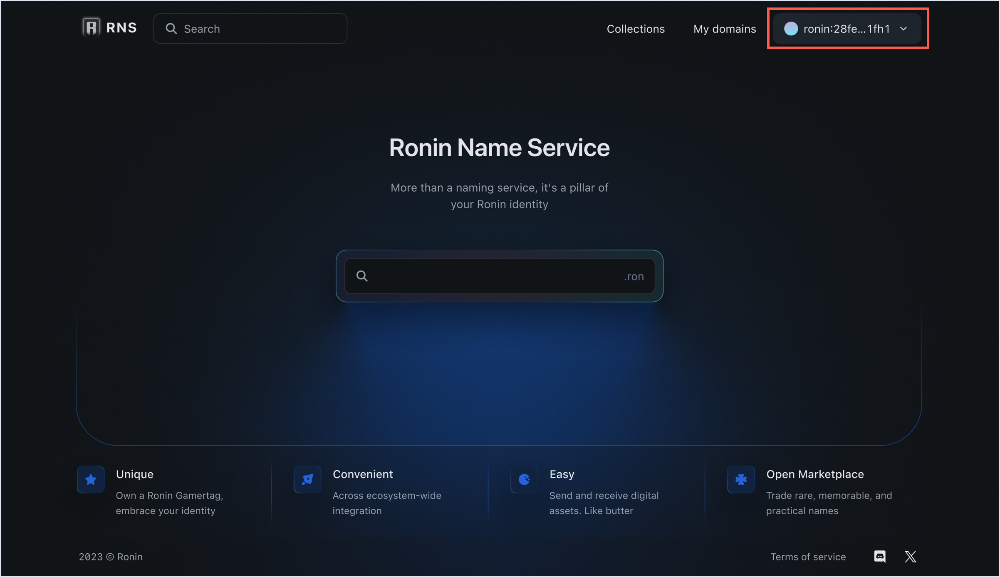
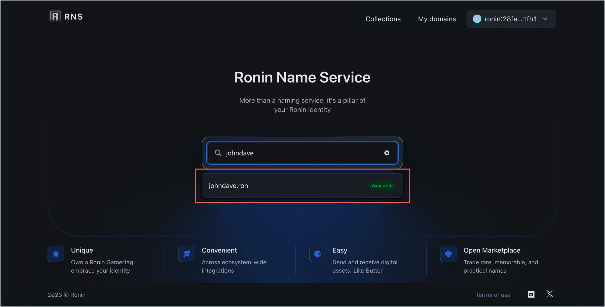
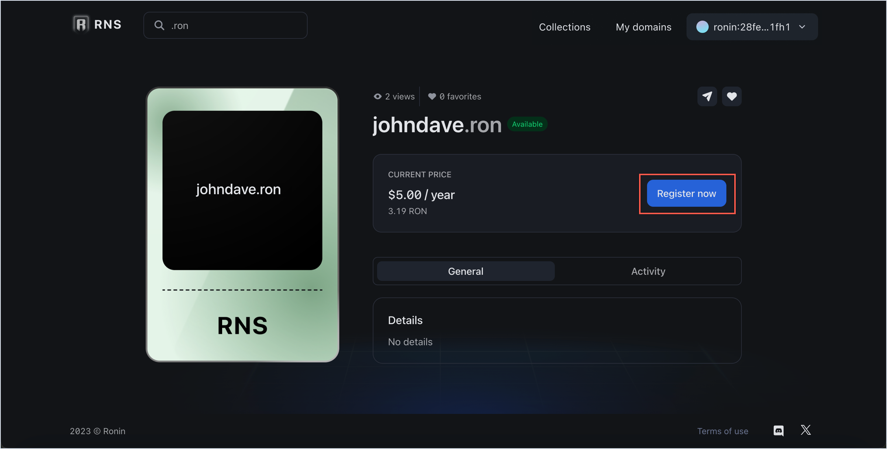
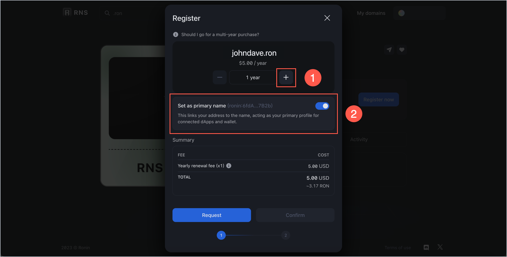
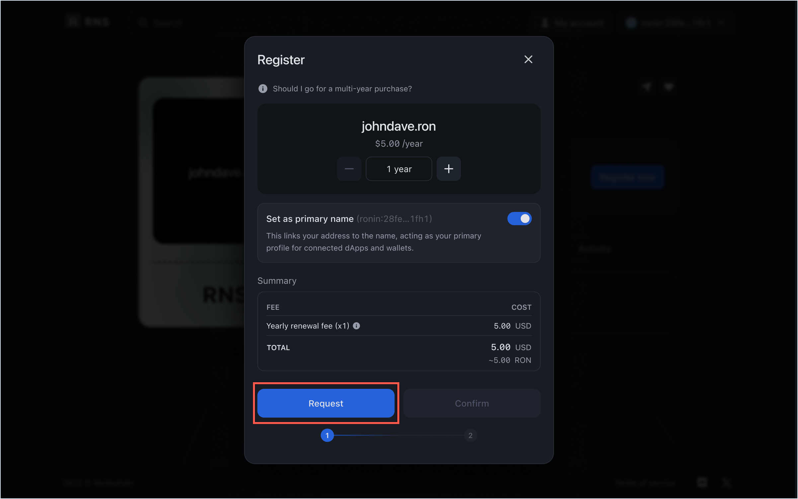
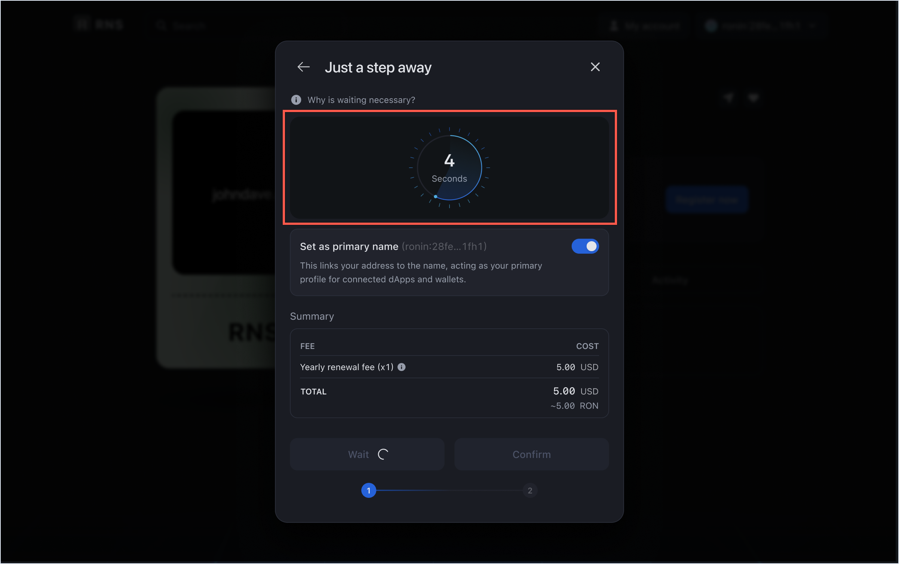
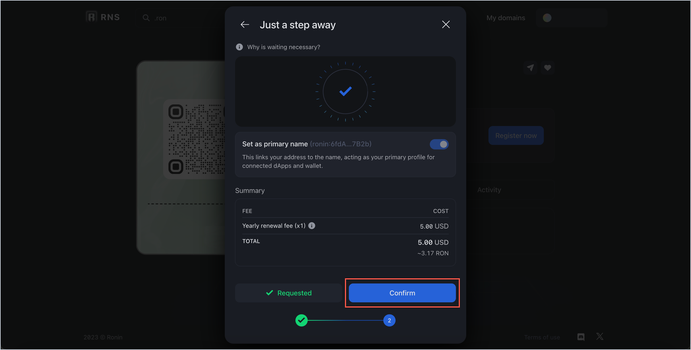
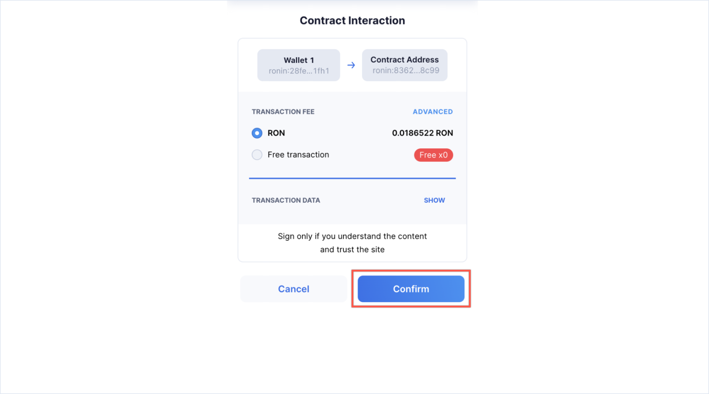
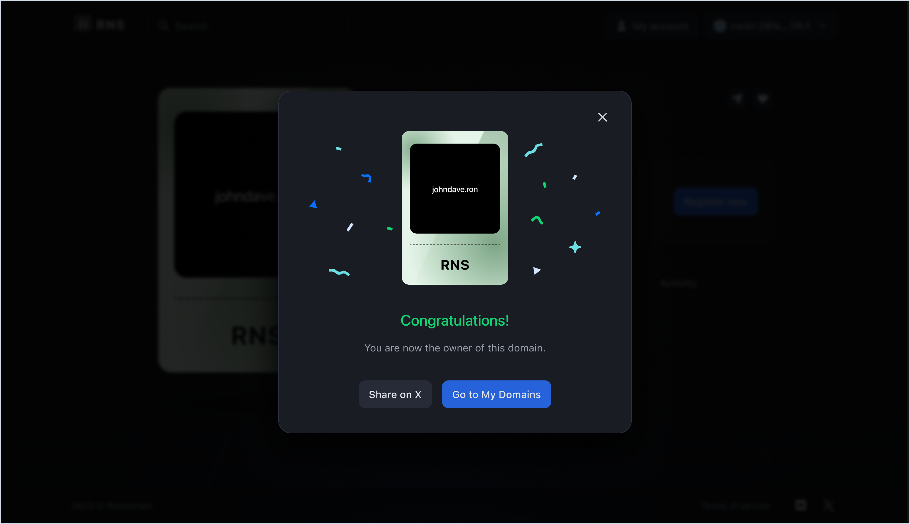

## Overview

This guide shows how to register a new `.ron` domain name for your Ronin address.

In Ronin Name Service (RNS), regular names are available on a first-come, first-served basis with an annual renewal fee that depends on the domain name's length. Regular names are listed as **Available**.

### Renewal fee

Following is the annual renewal fee for regular RNS names.

| Name length | Renewal fee |
|---|---|
| 5+ characters | $5/year |
| 4 characters | $100/year |
| 3 characters | $300/year |

### Naming guidelines

Following are the guidelines to be observed when choosing an RNS name:

* Domains can contain the English-language letters a-z, and the digits 0-9.
* Hyphens can also be used but not at the beginning and at the end of a domain name. Two hyphens together aren't permitted either.
* The minimum length is three characters.
* Domain names are case-sensitive and can only contain lowercase letters.

## Before you start

Before registering a regular domain, install [Ronin Wallet](https://wallet.roninchain.com) and create an account.

## Register a regular domain

1. Open the [RNS app](https://id.roninchain.com) and connect your Ronin Wallet.

1. Search for the domain you want to register, and then select it to open the domain info page.

1. The info page displays the renewal fee, domain tier, as well as other details. Click **Register now** to begin. The RNS registrar requires two transactions to register a regular name: *request transaction* and *registration transaction*.

1. At the request transaction, select the duration of your registration period in years (1).
   :::tip
   We recommend registering your RNS name for multiple years to avoid losing the domain to someone else.
   :::
   The renewal fee changes based on how many years you want to register the domain for. The minimum duration for the registration is 1 year. **Note:** This name is *set as primary* by default (2), which means that it's displayed as your RNS name in all the RNS-enabled apps.

1. Click **Request** to prompt the request transaction.

   Wait for a few seconds to get your request confirmed. As soon as it's confirmed, your domain is ready to be registered.

1. Click **Confirm** to register the domain.

1. At the registration transaction, click **Confirm** to pay the renewal fee.

1. After the registration transaction is complete, your RNS domain name is successfully registered.

You can now see your unique RNS name everywhere across the Ronin ecosystem. To view and manage your RNS names, click **Go to My Domains**.

## See also

* [Manage RNS names](./../../manage.md)
