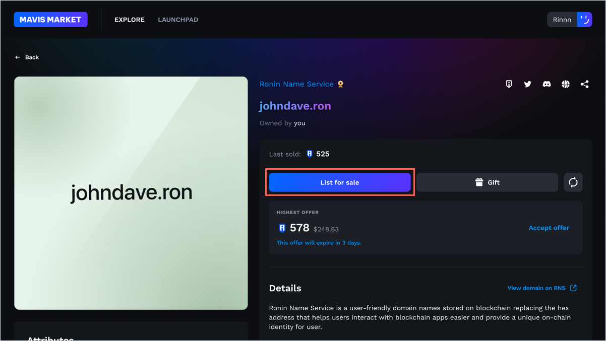
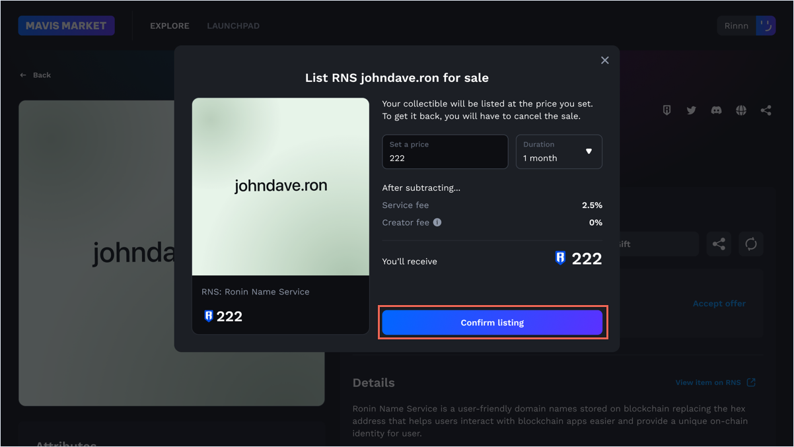
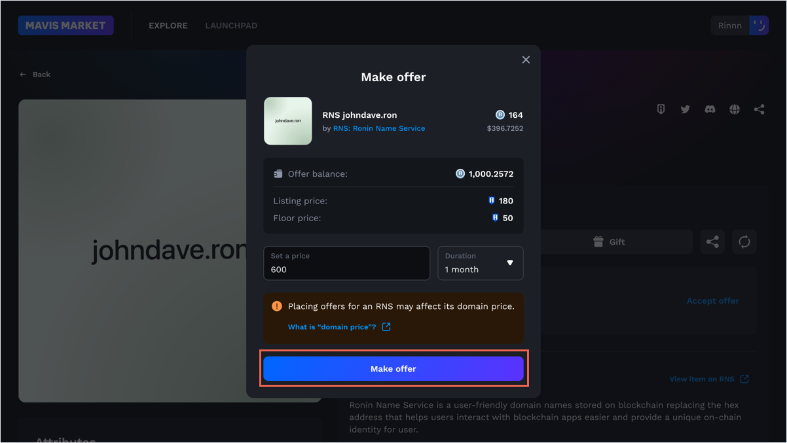
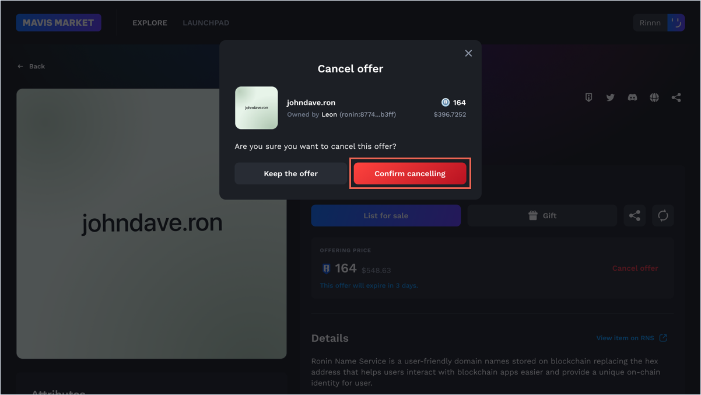
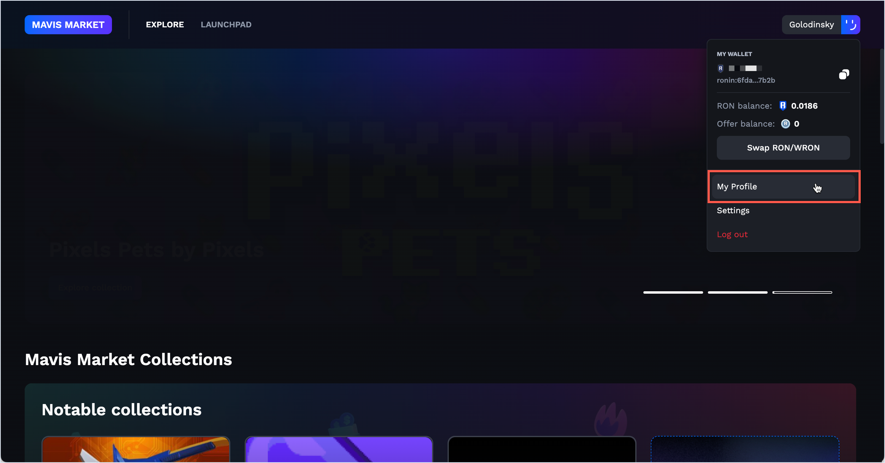
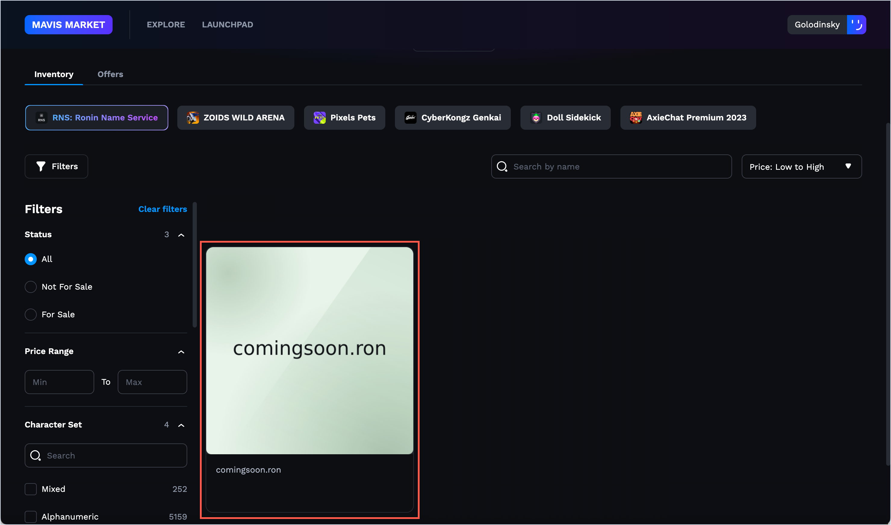
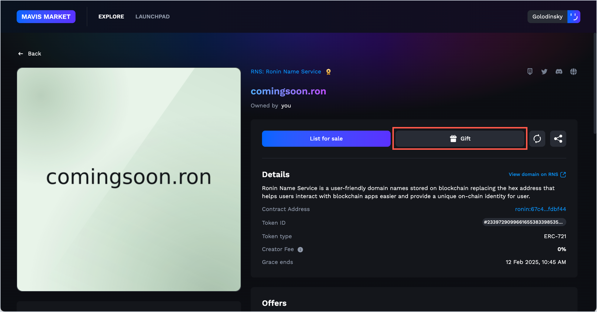
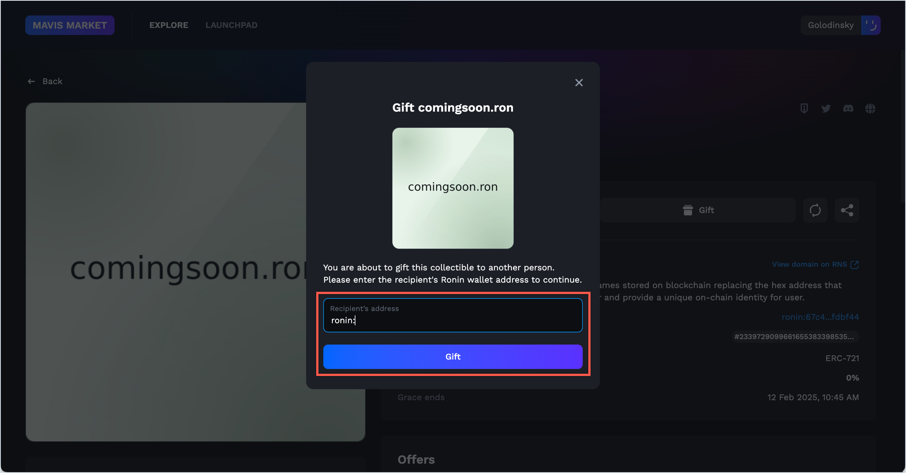
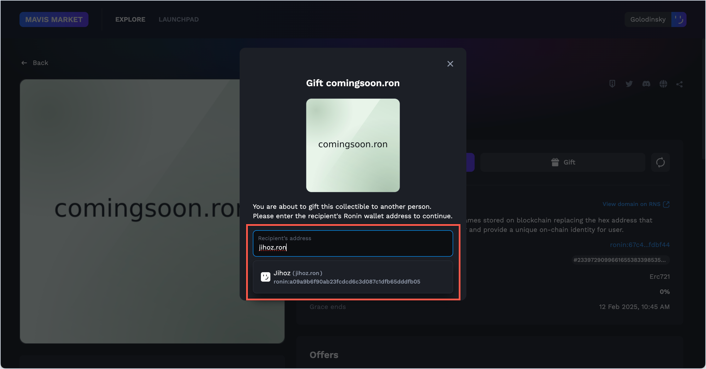

import rwTransferRns from '../assets/trade/rw-transfer-rns.png';
import rwTransferRnsNext from '../assets/trade/rw-transfer-rns-next.png';
import rwTransferRnsRoninAddComplete from '../assets/trade/rw-transfer-ronin-add-complete.png';
import rwTransferRnsNameComplete from '../assets/trade/rw-transfer-rns-name-complete.png';

## Overview

This guide demonstrates how to trade RNS domains on the Mavis Market marketplace by listing your domain for sale to other users or by making an offer to buy a domain from someone else.

## Sell an RNS name

### List for sale

You can list your RNS name on Mavis Market at a fixed price.

1. Click **List for sale** and sign the transaction to allow Mavis Market to use your NFT.
   
1. Choose the duration of the sale and set the price. Click **Confirm listing** to complete your listing.
   
1. Sign the transaction once more to list your domain.

If the owner lists a domain on Mavis Market and the listed price exceeds the current domain price, then, when another user buys the domain, the domain price changes to the listed price, also known as the *last sales price*.

Mavis Market charges a 2.5% service fee for a successful sale. For example, if someone buys your domain for 100 RON, you receive 97.5 RON.

### Edit your listing

To make a change to your listing, you need to cancel the existing listing and submit a new listing with the updated details.

### Accept an offer

When someone makes a few offers on your listing, you can view all of them at once. To accept an offer, click **Accept offer** on the offer you wish to accept. Payment is only accepted in WRON, not RON.

## Buy an RNS name

### Make an offer

Every newly registered (minted) RNS domain is searchable on Mavis Market.

If you want to purchase an RNS domain registered by someone else, you can make an offer to the owner. Enter the amount of WRON you wish to offer, select the duration of the offer, and click **Make offer**.

### Cancel an offer

Made an offer, but had second thoughts? You can cancel your offer anytime by clicking **Cancel offer**, then **Confirm cancelling**.

## Gift an RNS name {#gift-rns}

To gift an RNS name, simply transfer it to the recipient's Ronin address using any of the following platforms: Ronin Wallet, Mavis Market, or the Ronin gifting portal. After the transfer is complete, the gifted RNS name will appear in the recipient's Ronin Wallet under the **Collectibles** tab.

### Transfer an RNS name via Ronin Wallet {#gift-rns-ronin-wallet}

1. Open **Ronin Wallet**, select **Collectibles** (mobile app) or **NFTs** (browser extenstion), and then select **RNS**.

   
2. Choose the RNS name you want to transfer, and then select **Transfer**.
   
   
3. Enter the recipient's address and select **Next**.
   
   

   Or use the exact RNS name of the recipient, including the `.ron` part.
   
   
4. Sign the transaction to complete the transfer.

### Gift an RNS name via Mavis Market {#gift-rns-mavis-market}

1. Go to [Mavis Market](https://marketplace.skymavis.com), click your name in the top right-hand corner, and then select **My Profile**.
   
2. On the **Inventory** tab, choose the RNS NFT you want to give.
   
3. Select **Gift**.
   
4. Enter the recipient's address and click **Gift**.
   
   Or use the exact RNS name of the recipient, including the `.ron` part.
   
5. Sign the transaction to complete the transfer.

### Gift an RNS name via Ronin Gifting Portal

For information about gifting an RNS name via the Ronin Gifting Portal, refer to the **Send a gift** section in this [help article](https://support.roninchain.com/hc/en-us/articles/19451168526107-Ronin-Gifting-Portal).

## See also

[Manage RNS names](manage.md)
