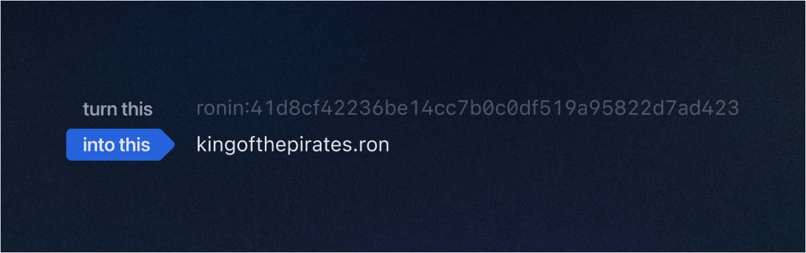

## Overview

Ronin Name Service (RNS) is a distributed naming system based on the Ronin blockchain that lets you assign a human-readable `.ron` domain name to your long Ronin address:



By using your RNS name instead of your Ronin address, you can send funds and NFTs to a human-readable name vs. the long string of numbers and characters. RNS is integrated with games, wallets, and dApps, making your `.ron` domain name a unique callsign across the entire Ronin ecosystem.

The RNS service is accessible on [id.roninchain.com](https://id.roninchain.com/). This web portal serves as a convenient interface for managing your RNS domains, enabling you to register, manage, and use easy-to-remember names instead for your long and complex Ronin addresses.

:::info Developer documentation
Looking to use RNS in your dApp? Visit [RNS developer documentation](https://docs.skymavis.com/ronin/rns).
:::

## Domain name categories

There are four categories of domain names in RNS:

* **Regular names:** These unregistered domain names, available on a first-come, first-served basis, come with an annual renewal fee.
* **Auctioned names:** These highly sought-after RNS names, such as `adventure.ron` and `moonshard.ron`, are distributed through auctions where the highest bidder wins.
* **Protected names:** Names reserved for Sky Mavis's official partners and other brands and businesses. For instance, we ensure that `battlebears.ron` remains exclusive to the Battle Bears team, safeguarding our communities from malicious actors.
* **Blacklisted names:** Names with negative connotations, sensitive themes, or deceptive potential that aren't available for registration.

## Domain price

The price of an RNS domain name depends on the following factors:

* **Renewal fee:** A fee charged for the registration duration, in years. This is a fixed fee based on the length of the domain name, applying only to regular names. For protected names, Sky Mavis sets the amount individually for each registrant.
* Additional fees applied to auctioned domains:
  * **Domain price:** Set by the market during the auction. The first participant makes a starting bid, then someone else makes a higher bid, and so on. After the auction period, trading (buying or selling) the auctioned domain in the Mavis Market may affect its domain price.
  * **Reservation fee:** 15% of the auctioned domain's price. This fee applies only to auctioned names and is charged when you renew the domain name after it expires.

## Domain tiers

RNS uses *domain tiers* to indicate the rarity and value of domain names based on their character composition and market price.

The domain's tier is easily identified by its color card, which can be gold, blue, or green.


Domain tiers apply to all RNS names except protected names that are reserved for brands and businesses. Protected names also have a unique color card—purple—but their prices are set by Sky Mavis.

Regular names follow the number of characters for the tier system, and auctioned names follow a tier system based on their *tier value*. Here's the formula used to calculate the tier value of an auctioned RNS name:

```text
Tier value = (0.5 x domain price) + renewal fee
```

The following sections describe how RNS determines each tier.

### Tier 1

These are `.ron` names with a tier value above \$200. In general, this encompasses any 3-character names, names belonging to special collections, and auctioned names with a tier value above \$200. Certain creator and community member names, however, may have also received Tier 1 designation.

### Tier 2

These are `.ron` names with a tier value between \$50 and \$200 according to the calculation above. This includes any 4-character regular names, and auctioned names with a tier value between \$50 and \$200 acquired via auction.

### Tier 3

These are `.ron` names that are neither Tier 1 or Tier 2. In general, this includes names with 5 characters or more that do not belong to select brands or creators. These names have a tier value below \$50.

### How an RNS name's tier can change

An RNS name’s domain price increases if the name is later sold at a higher price, or if the name has a valid offer at a higher price on Mavis Market. In this case, the name might change tiers. For example, a Tier 3 RNS name that is sold for \$100 becomes a Tier 2 RNS name.

If the RNS name doesn't receive any higher offers for three consecutive months, its domain price decreases by 5%. In this case, the name might change tiers in the opposite direction. For example, a Tier 2 name whose tier value dropped below \$50 due to the 5% price decrease becomes a Tier 3 name.

## Next steps

* [Register a regular RNS name](rns/register/regular)
* [Buy an RNS name at auction](rns/register/auctioned)
* [Register a protected RNS name](rns/register/protected)
