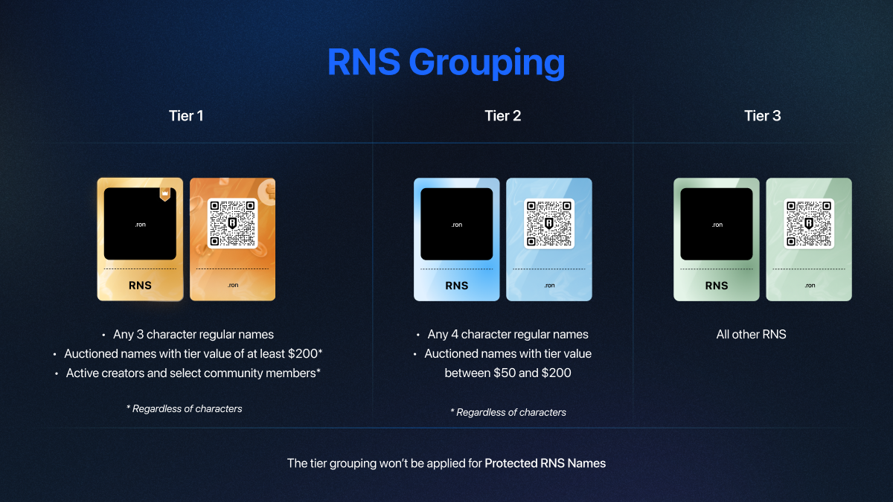

import rnsHome from './assets/rns-home.png';

## Overview

Ronin Name Service (RNS) is a distributed naming system based on the Ronin blockchain that lets you assign a human-readable `.ron` domain name to your long Ronin address:

* **Turn this:** `ronin:41d8cf42236be14cc7b0c0df519a95822d7ad423`
* **Into this:** `kingofthepirates.ron`

By using your RNS name instead of your Ronin address, you can send funds and NFTs to a human-readable name vs. the long string of numbers and characters. RNS is integrated with games, wallets, and dApps, making your `.ron` domain name a unique callsign across the entire Ronin ecosystem.

:::info Developer documentation
Looking to use RNS in your dApp? Visit [RNS developer documentation](https://docs.skymavis.com/ronin/rns).
:::

## Domain name categories

There are four categories of domain names in RNS:

* **Regular names:** These unregistered domain names, available on a first-come, first-served basis, come with an annual renewal fee.
* **Auctioned names:** These highly sought-after RNS names, such as `adventure.ron` and `moonshard.ron`, are distributed through auctions where the highest bidder wins.
* **Protected names:** Names reserved for official partners and key community members. For instance, Sky Mavis ensures that `battlebears.ron` remains exclusive to the Battle Bears team, safeguarding our communities from malicious actors.
* **Blacklisted names:** Names with negative connotations, sensitive themes, or deceptive potential that aren't available for registration.

## Domain price

The price of an RNS domain name depends on the following factors:

* **Renewal fee:** A fee charged for the registration duration, in years. This is a fixed fee based on the length of the domain name, applying only to regular and protected names. For protected names, Sky Mavis sets the amount individually for each registrant.
* Additional fees applied to auctioned domains:
  * **Domain price:** Set by the market during the auction. The first participant makes a starting bid, then someone else makes a higher bid, and so on.
  * **Reservation fee:** 15% of the auctioned domain's price. This fee applies only to auctioned names and is charged when you renew the domain name after it expires.

## Domain tiers

RNS uses *domain tiers* to indicate the rarity and value of domain names based on their character composition and market price.

The domain's tier is easily identified by its color card, which can be yellow, blue, or green. Domain tiers apply to all RNS names except protected names and special names, such as those owned by active creators, community members, and Mystic owners. These special domain names also have a unique color card—purple—but their prices are directly set by Sky Mavis.

The domain's tier is determined using the following formula: `X = 0.5 x domain price + annual renewal fee`. As such, there are three tiers:

* Tier 1 (yellow): X &#8805; &#36;200
* Tier 2 (blue): &#36;200 &gt; X &#8805; &#36;50
* Tier 3 (green): &#36;50 &gt; X &#8805; 0

Each tier typically contains the following groups of domains:

* Tier 1: This tier includes three-character names, auctioned names with the value of X of at least $200, and some community and creator names.
* Tier 2: This tier comprises two-character names and auctioned names with the value of X between $50 and $200.
* Tier 3: The remaining RNS names fall into this tier.

## Next steps

* [Register a regular RNS name](rns/register/regular)
* [Buy an RNS name at auction](rns/register/auctioned)
* [Register a protected RNS name](rns/register/protected)
