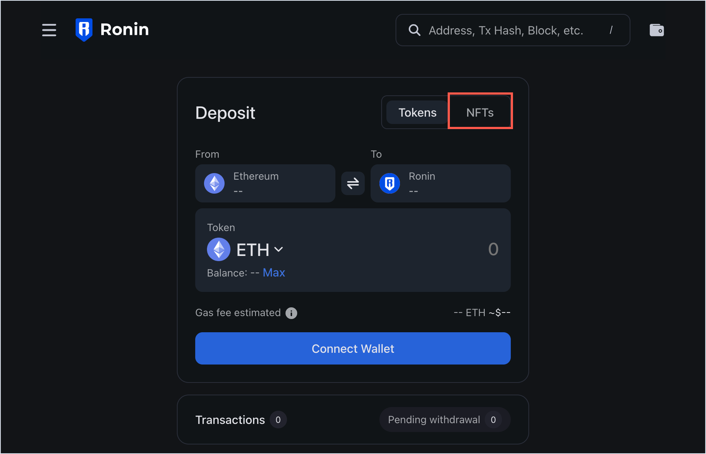
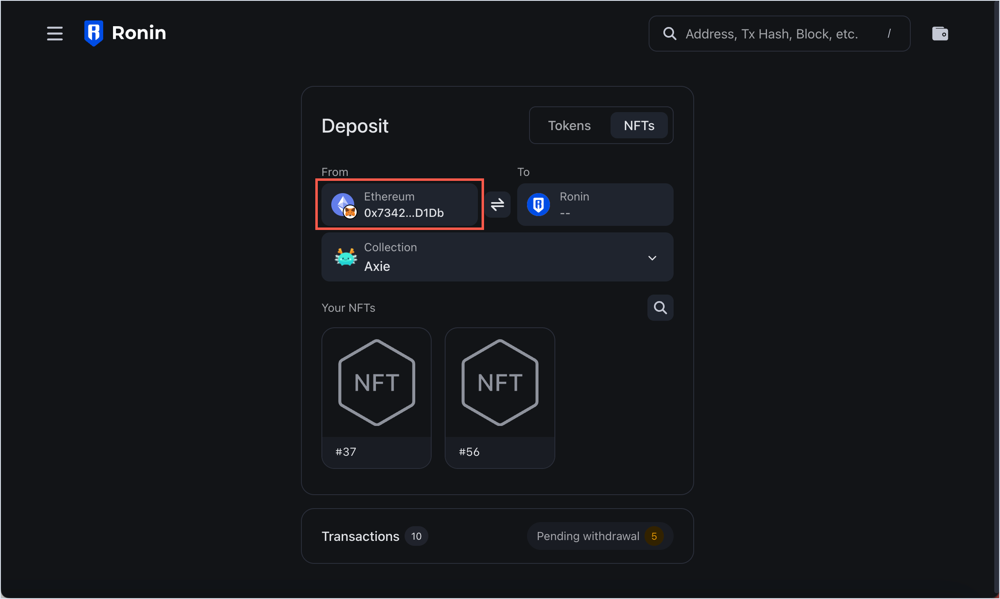
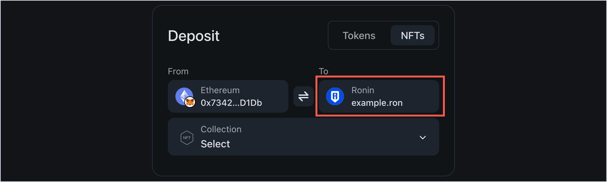
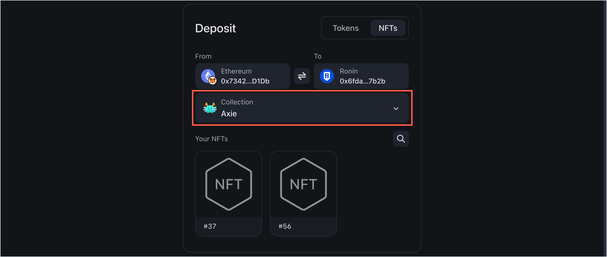
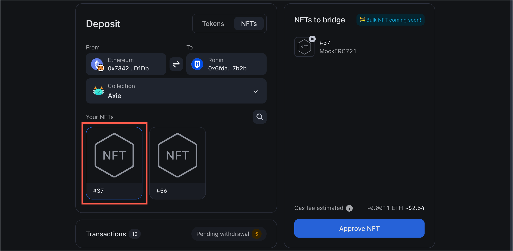
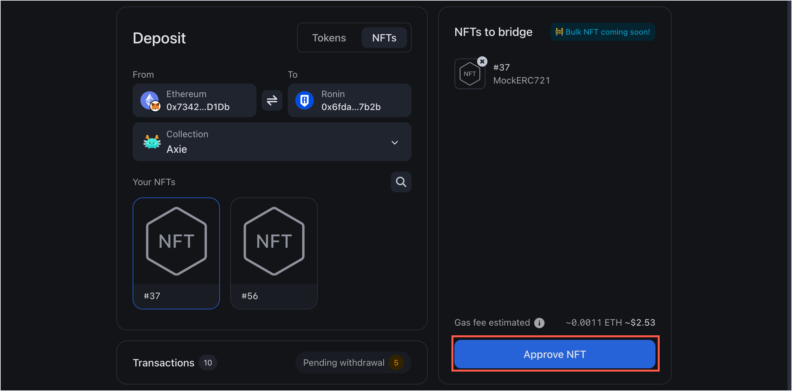
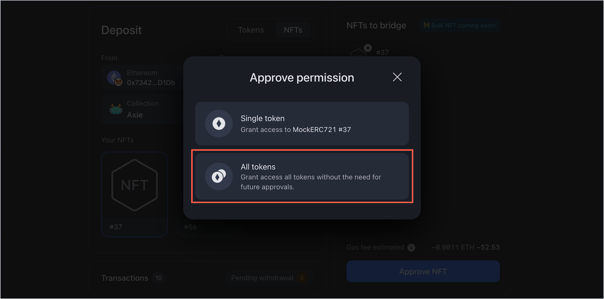
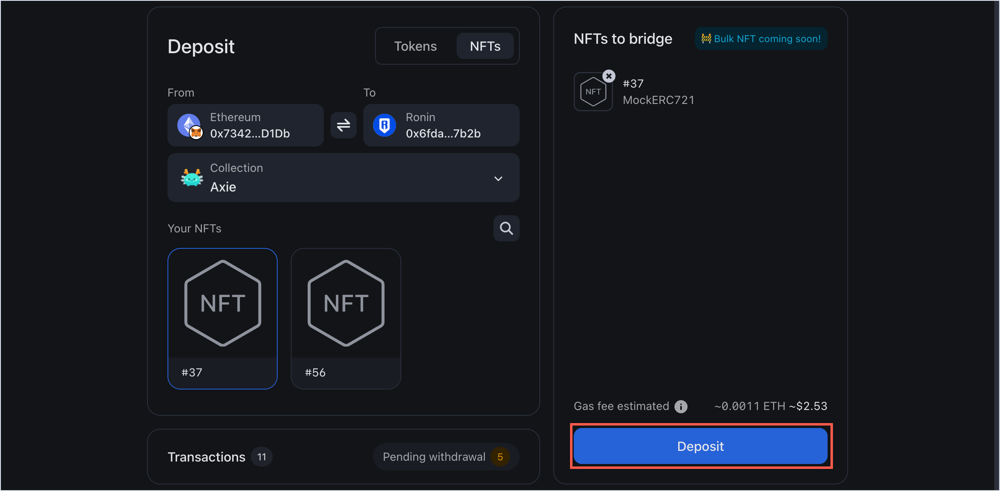
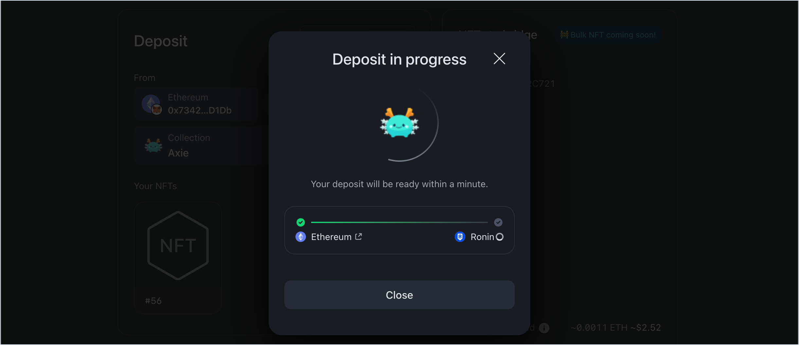
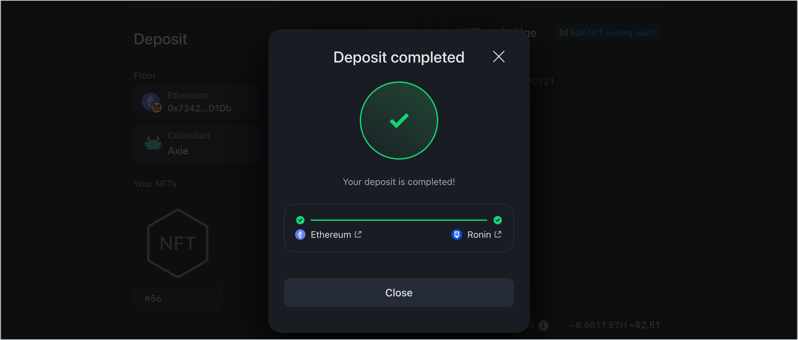

## Overview

This guide describes how to use Ronin Bridge to send an NFT (non-fungible token) from your Ethereum address to your Ronin Wallet.

## Prerequisites

If you access Ronin Bridge on mobile, remember to import your Ethereum address to your mobile Ronin Wallet. To learn how to do that, see [Importing Your MetaMask Wallet to Ronin Wallet](https://support.roninchain.com/hc/en-us/articles/14862812718107-Importing-Your-MetaMask-Wallet-to-Ronin-Wallet).

## Step 1. Add the sender and recipient addresses

1. Go to [https://app.roninchain.com/bridge](https://app.roninchain.com/bridge), then select the **NFTs** tab.
   
2. In the **From** field, connect the Ethereum wallet that you want to bridge the NFT from.
   
3. In the **To** field, enter the Ronin address that you want to deposit the NFT into. You can also enter the RNS (Ronin Name Service) domain name linked to the address, such as "example.ron". Make sure to specify the *full RNS name* including the ".ron" part, so that the system can recognize the linked address.
   
   :::note[RNS integration]
   If the recipient address has an RNS name linked to it, the **To** field will automatically show the RNS name instead of the address.
   
   :::

## Step 2. Select the NFT to deposit

1. Choose the collection containing the NFTs you want to deposit.
   
2. In the collection, select the specific NFT.
   

## Step 3. Approve the NFT

When a smart contract interacts with an NFT in your wallet, you may be prompted to approve the token.

1. With the NFT selected, click **Approve NFT**.
   
2. Select **Single token** to grant access to a single NFT.
   
   Or select **All tokens** to grant access to all tokens from that collection. You can revoke your approval later using the [Token Revoke](https://ronin.axiedao.org/revoke/) tool.
   
3. When prompted, sign the transaction in your connected wallet.

## Step 4. Confirm your deposit

1. Review the transaction details, including the gas fees associated with the deposit. Make sure you have enough ETH in your Ethereum wallet to pay gas. If everything looks correct, select **Deposit**.
   
2. When prompted, sign the transaction in your connected wallet.
3. Wait for the transaction to be confirmed by the network. Be patient, however, as transactions can take some time to complete, depending on network congestion and gas fees.
   

## Step 5. Receive the NFT in your Ronin Wallet

When the deposit is complete, you'll see a "Deposit completed" window.

You should be able to see the NFT in your Ronin Wallet, on the **NFTs** tab.
