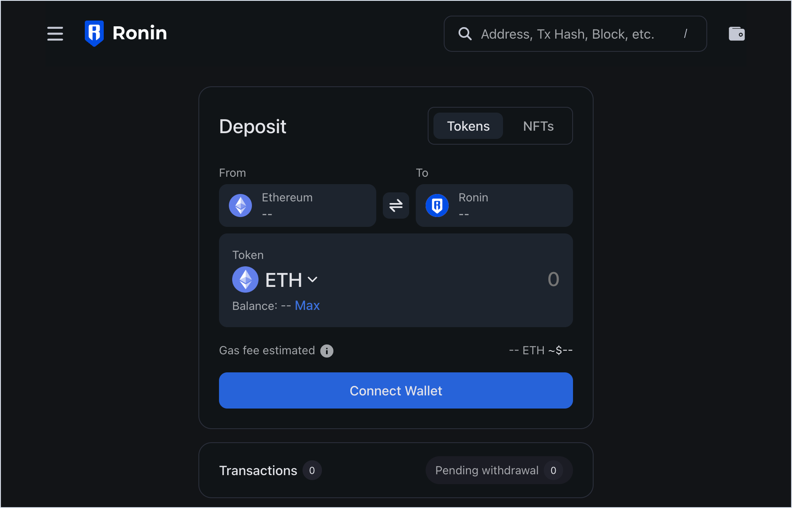
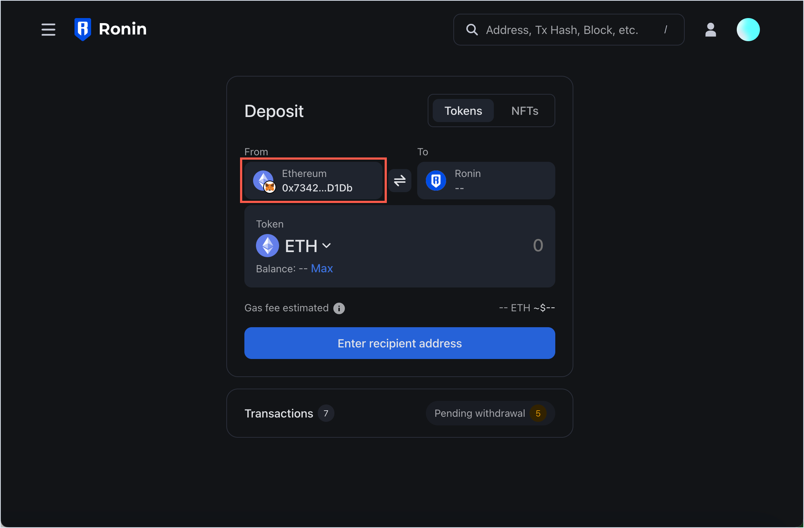
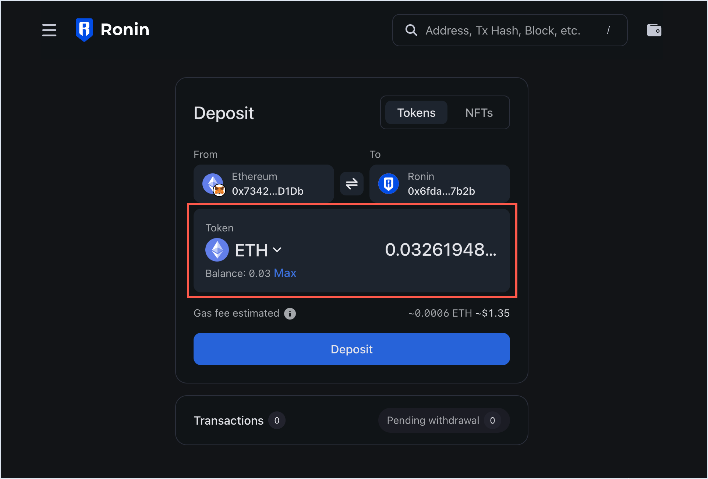
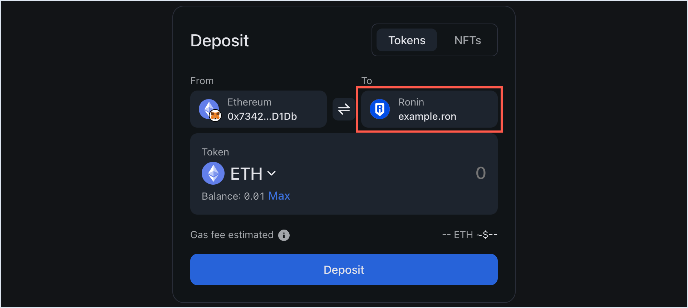
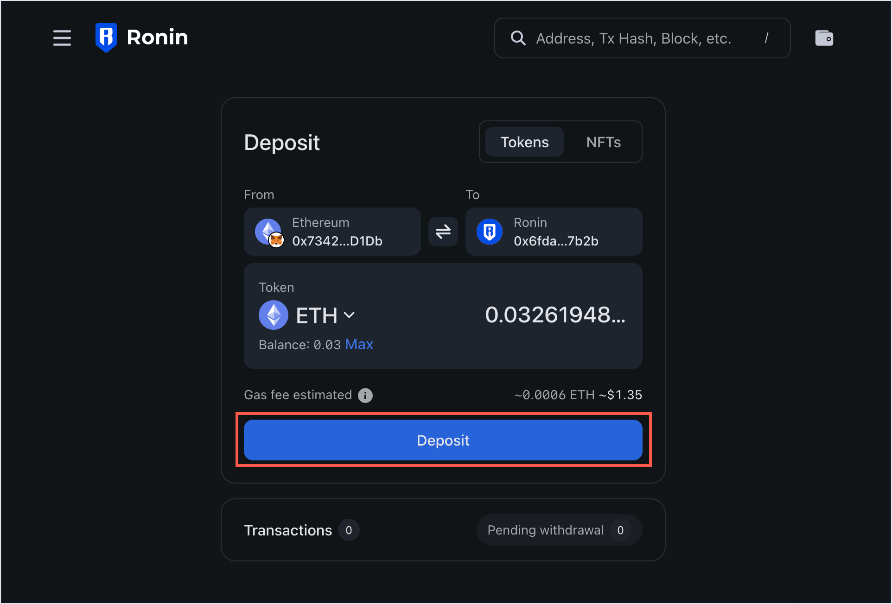
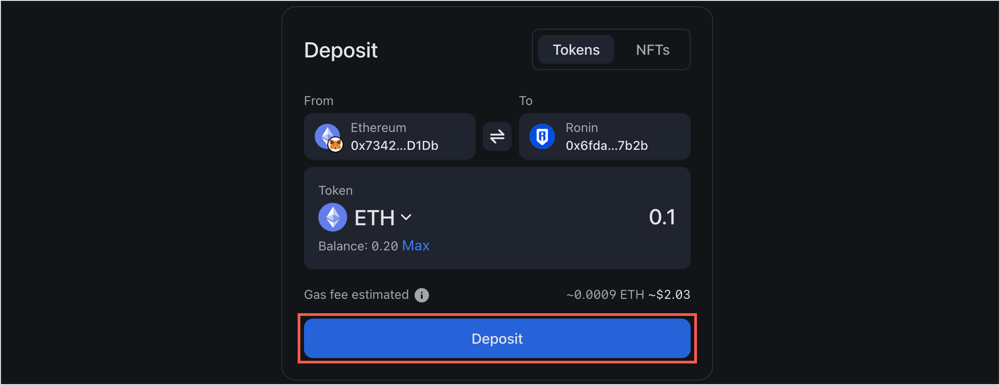
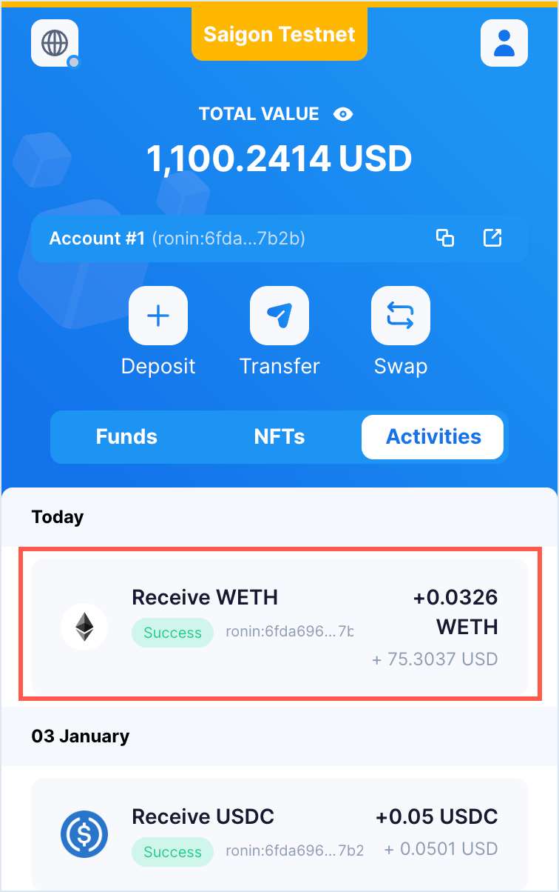
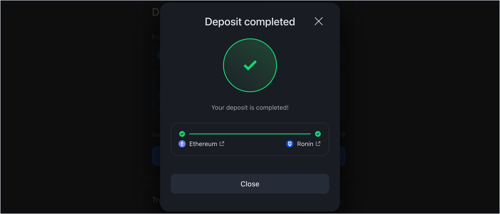

## Overview

This guide describes how to use Ronin Bridge to send an ERC20 token from your Ethereum wallet, such as MetaMask or Trust Wallet, to an address on the Ronin chain.

## Prerequisites

If you access Ronin Bridge through the Ronin Wallet mobile app, then you can only connect Ethereum wallets imported into your Ronin Wallet beforehand.

To import your Ethereum wallets, see [Importing Your MetaMask Wallet to Ronin Wallet](https://support.roninchain.com/hc/en-us/articles/14862812718107-Importing-Your-MetaMask-Wallet-to-Ronin-Wallet).

## Step 1. Add the sender and recipient addresses

1. Open [Ronin Bridge](https://app.roninchain.com/bridge).
   
2. In the **From** field, connect the Ethereum wallet that you want to transfer the token from. The supported wallets include MetaMask and Trust Wallet.
   
3. In the **To** field, enter the Ronin address that you want to deposit the token into. You can also enter the RNS (Ronin Name Service) domain name linked to the address, such as "example.ron". Make sure to specify the *full RNS name* including the ".ron" part, so that the system can recognize the linked address.
   
   :::note[RNS integration]
   If the recipient address has an RNS name linked to it, the **To** field will automatically show the RNS name instead of the address.
   
   :::

## Step 2. Choose the token and amount

Choose the ERC20 token that you want to deposit, then enter the amount manually or select **Max** to transfer the entire balance of this token available in your connected wallet.

## Step 3. Confirm your deposit

1. Review the transaction details, including the gas fees associated with the deposit. Make sure you have enough ETH in your Ethereum wallet to cover the fees. If everything looks correct, select **Deposit**.
   
2. When prompted, sign the transaction in your connected wallet.
3. Wait for the transaction to be confirmed by the network. Be patient, however, as transactions can take some time to complete, depending on network congestion and gas fees.
   

## Step 4. Receive the tokens in your Ronin Wallet

When the deposit is complete, you'll see a "Deposit completed" window.

You should be able to see the deposited amount in your Ronin Wallet, on the **Funds** tab in the browser extension, or the **Tokens** tab in the mobile app.
