## Overview

This guide describes how to use Ronin Bridge to send an NFT (non-fungible token) from your Ronin Wallet to an Ethereum wallet. For information on supported Ethereum wallets and NFT collections, see [Ronin Bridge](../overview.md).

## Prerequisites

If you access Ronin Bridge through the Ronin Wallet mobile app, then you can only connect Ethereum wallets imported into your Ronin Wallet beforehand. For more information, see [Importing Your MetaMask Wallet to Ronin Wallet](https://support.roninchain.com/hc/en-us/articles/14862812718107-Importing-Your-MetaMask-Wallet-to-Ronin-Wallet).

## Step 1. Fill in the details

1. Open the [Ronin Bridge](https://app.roninchain.com/bridge) app on the **Deposit NFTs** tab.
2. Switch to the **Withdraw NFTs** tab by selecting the button between the **From** and **To** fields.
   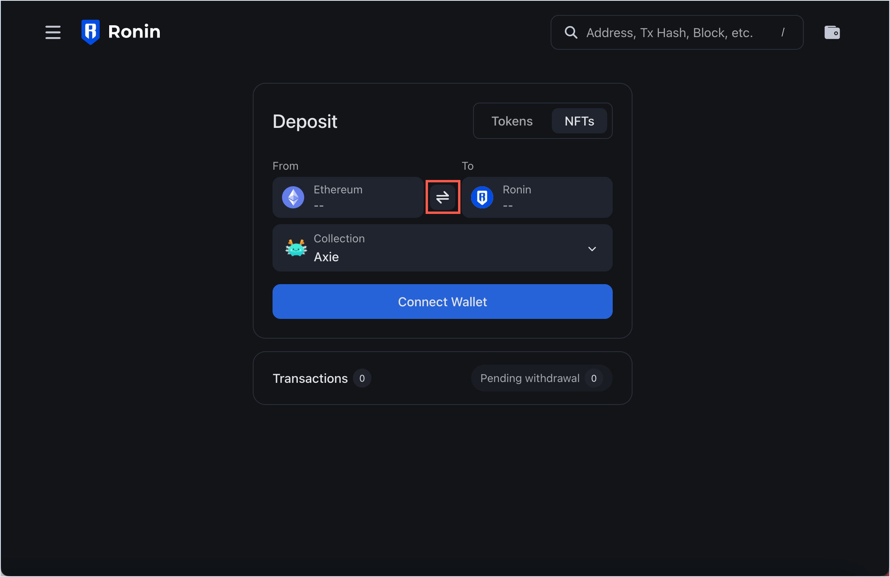
3. In the **From** field, connect your Ronin Wallet using the browser extension or mobile app.
   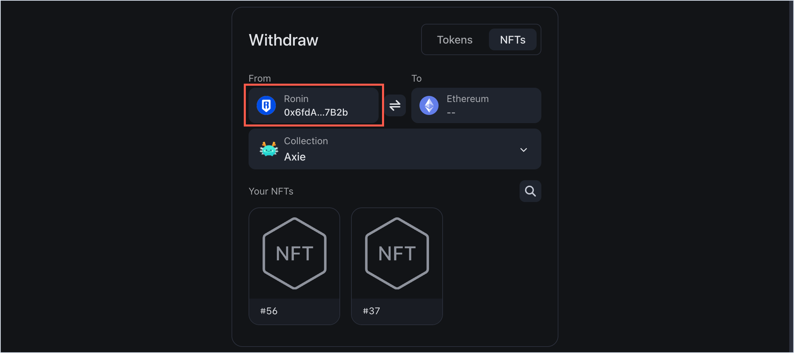
4. In the **To** field, enter the Ethereum address that you want to transfer the NFT to. **Note:** In the mobile Ronin Wallet app, you can enter any Ethereum address, but only your imported wallet will cover the gas fees for the transaction.
   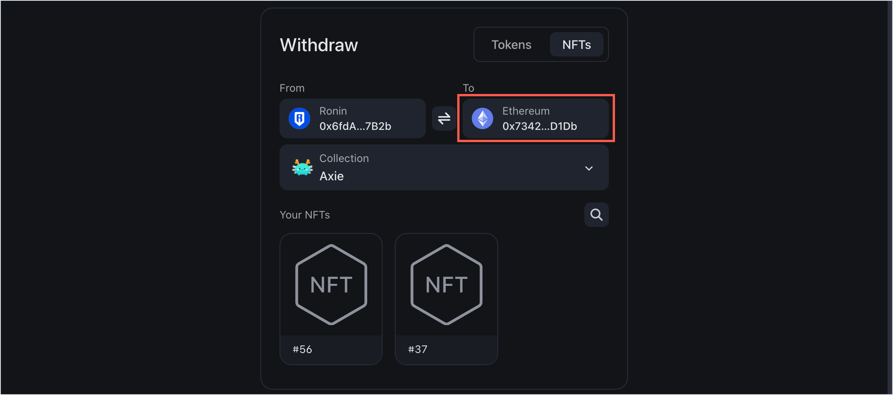

Double-check the recipient address to avoid sending your NFT to the wrong destination.

## Step 2. Select the NFT to withdraw

1. Choose the collection containing the NFTs you want to withdraw.
   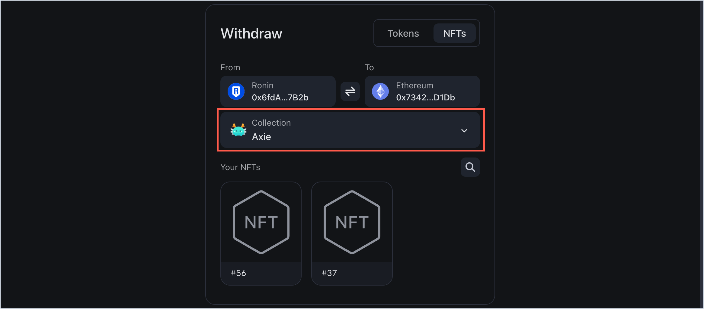
2. In the collection, select the specific NFT.
   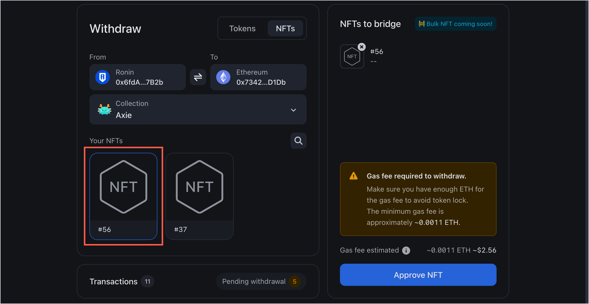

## Step 3. Authorize the bridge to transfer your NFT

To withdraw an NFT, you need to grant Ronin Bridge permission to transfer it, which is also referred to as *approval*. You have two ways to do it: approve a single token or approve all tokens.

### Approve a single token

You can choose to grant permission to each individual NFT that you transfer:

1. With the NFT selected, click **Approve NFT**.
   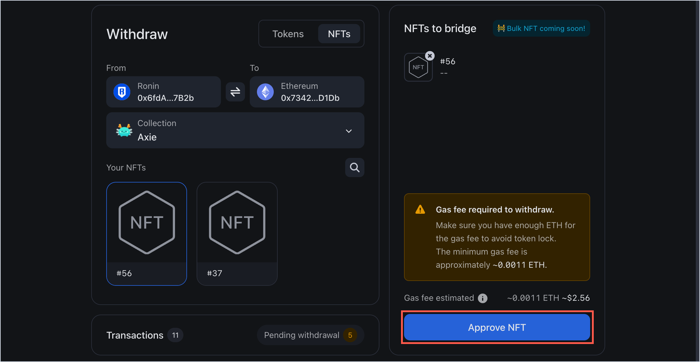
1. Select **Single token**.
   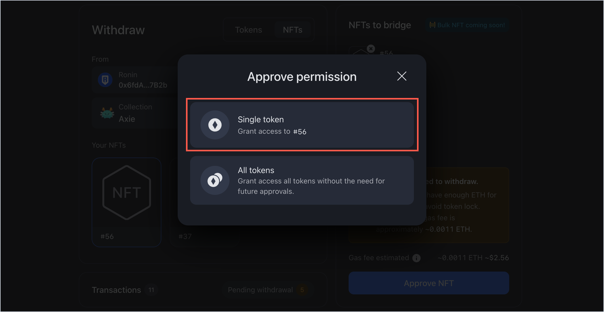

When you make another transfer in the future, you will need to approve it again.

### Approve all tokens

Alternatively, grant access to all your tokens at once to bypass the single token approval step in the future:

1. Select the NFT you want to transfer, then click **Approve NFT**.
   
1. Select **All tokens**.
   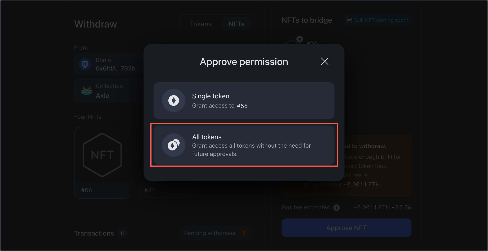

This way, your future transfers will not require approvals.

## Step 4. Withdraw your NFT

1. Review the transaction details, including the gas fees associated with the withdrawal. Make sure you have enough ETH in your Ethereum wallet to cover the fees. If everything looks correct, select **Submit withdrawal**.
   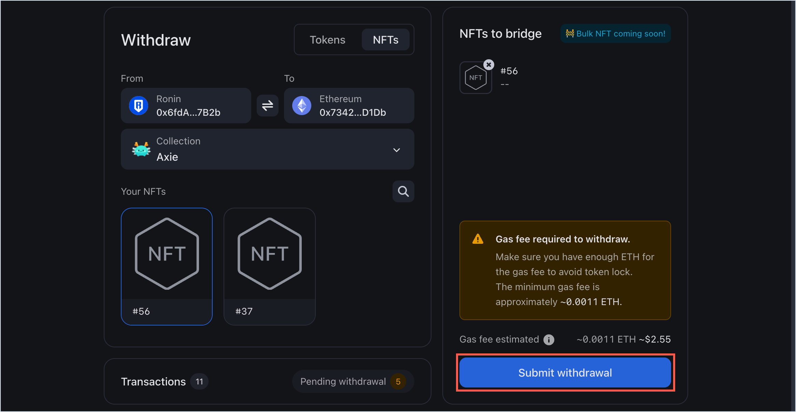
2. When prompted, sign the transaction in your Ronin Wallet.
3. Select **Connect Wallet** and connect your Ethereum wallet.
   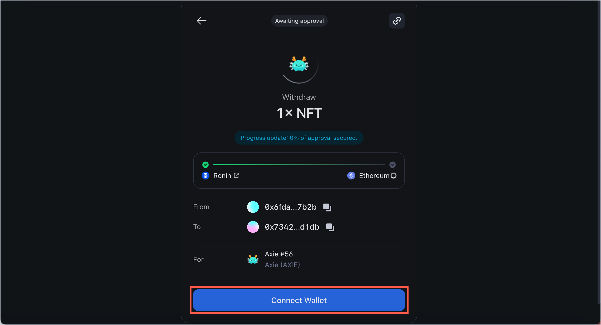
4. Wait for the transaction to be confirmed by the network. Be patient, however, as transactions can take some time to complete, depending on network congestion and gas fees.
   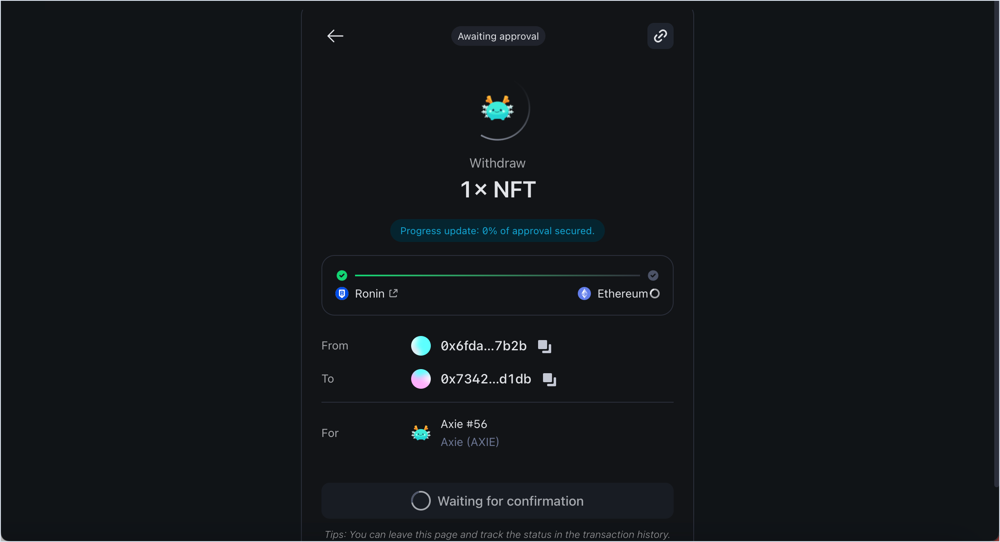
5. When the NFT is ready to be withdrawn, select **Withdraw** to transfer it to your Ethereum address.
   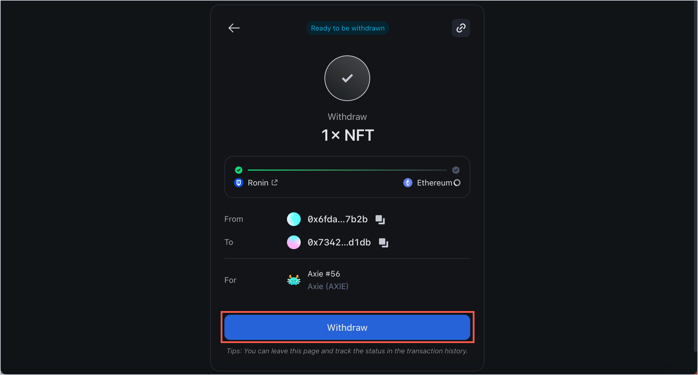
6. When prompted, sign the transaction in your connected Ethereum wallet to receive the transfer.

## Step 5. Receive the NFT in your Ethereum wallet

When the withdrawal is complete, you'll see a "Withdrawal completed" window.
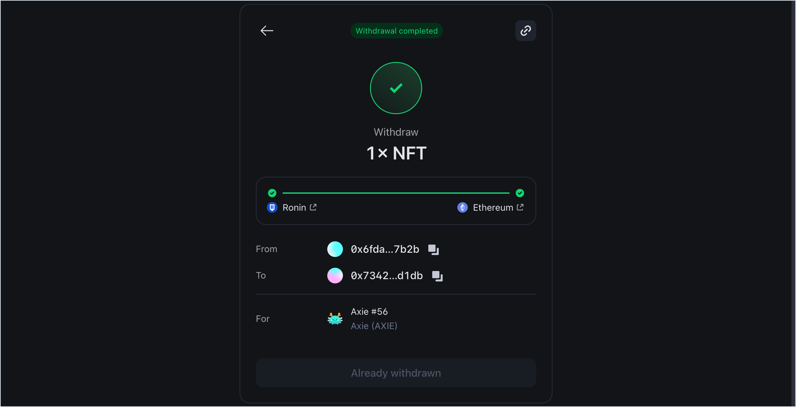
You can now check your connected wallet to verify that the NFT has arrived successfully.
