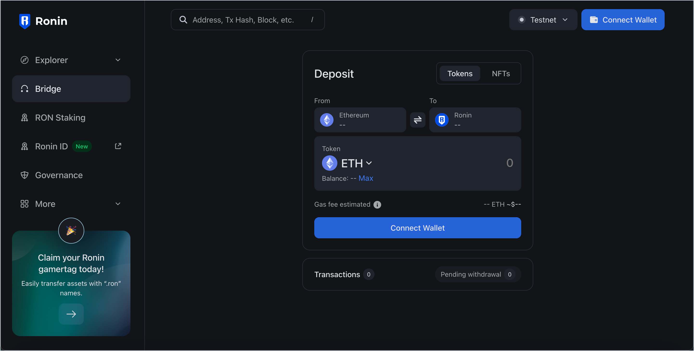
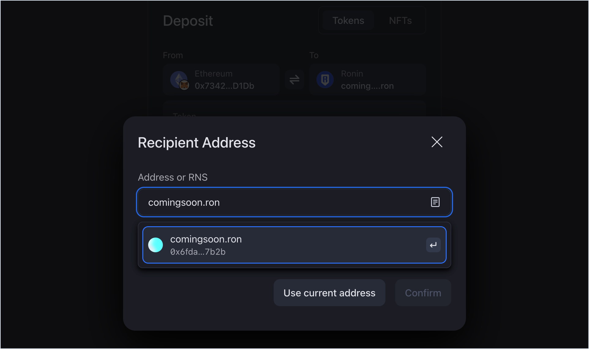

## Overview

Ronin Bridge ([app.roninchain.com/bridge](https://app.roninchain.com/bridge)) is an app for transferring ERC20 tokens and NFTs (non-fungible tokens) between Ethereum and the Ronin chain.

This is a multi-signature bridge, which means that when you make a transaction, multiple bridge operators have to approve it before it's finalized. This approach makes the bridge a secure choice for cross-chain transactions, preventing any single party from acting maliciously or making unauthorized changes.

## User guides

* [Deposit an ERC20 token](./guides/deposit-token.md)
* [Withdraw an ERC20 token](./guides/withdraw-token.md)
* [Deposit an NFT](./guides/deposit-nft.md)
* [Withdraw an NFT](./guides/withdraw-nft.md)

## Supported wallets

Ronin Bridge supports the following wallets:

* [Ronin Wallet](https://wallet.roninchain.com/)
* [MetaMask](https://metamask.io/)
* [Trust Wallet](https://trustwallet.com/)
* [Coinbase Wallet](https://www.coinbase.com/wallet)

## Supported assets

### ERC20 tokens

With Ronin Bridge, you can transfer the following ERC20 tokens:

* Deposit: ETH, AXS, SLP, USDC, AGG, PIXEL, BANANA, AEC
* Withdrawal: WETH, AXS, SLP, USDC, AGG, PIXEL, BANANA

Withdrawal limits apply. For more information, see [Withdrawal limits](./reference/withdrawal-limits.md).

### ERC721 tokens (NFTs)

With Ronin Bridge, you can transfer NFTs (non-fungible tokens) from the following collections:

* Cyberkongz Genkai
* Cyberkongz VX
* Pixels Farm Land (coming soon)

## RNS compatible

When sending a token or NFT to an address on the Ronin chain, you can enter either a standard crypto address that starts with "0x...", or an RNS (Ronin Name Service) name, such as "example.ron".

Make sure to type in the *full RNS name* including the ".ron" part, so that the system can recognize the linked address.

For more information about RNS, see [Register an RNS name](../rns/guides/register/regular.md).
