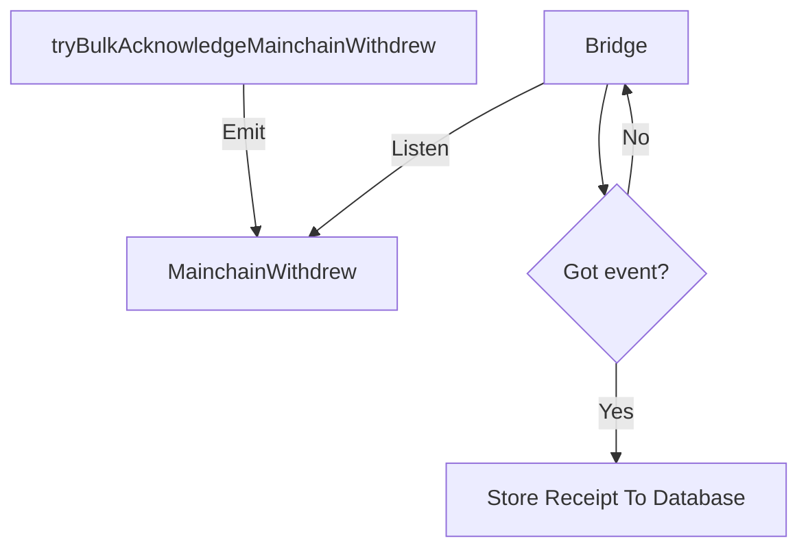
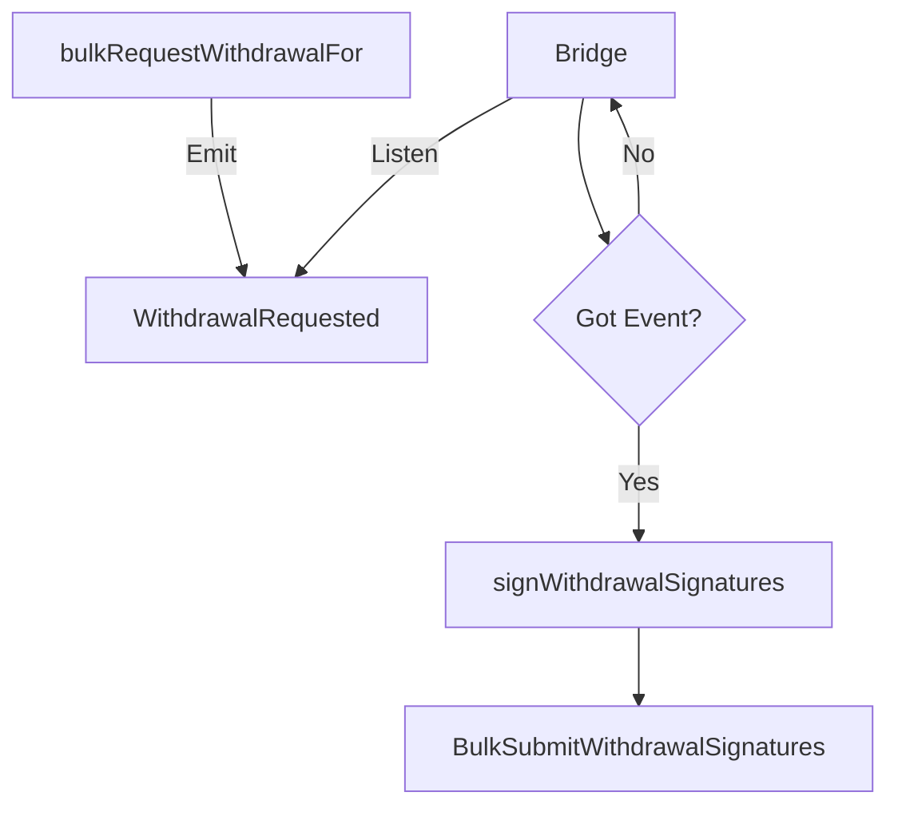
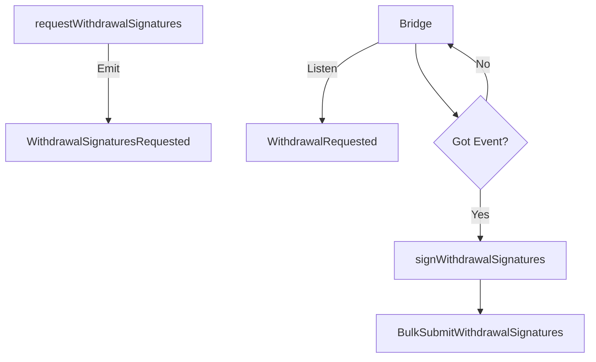
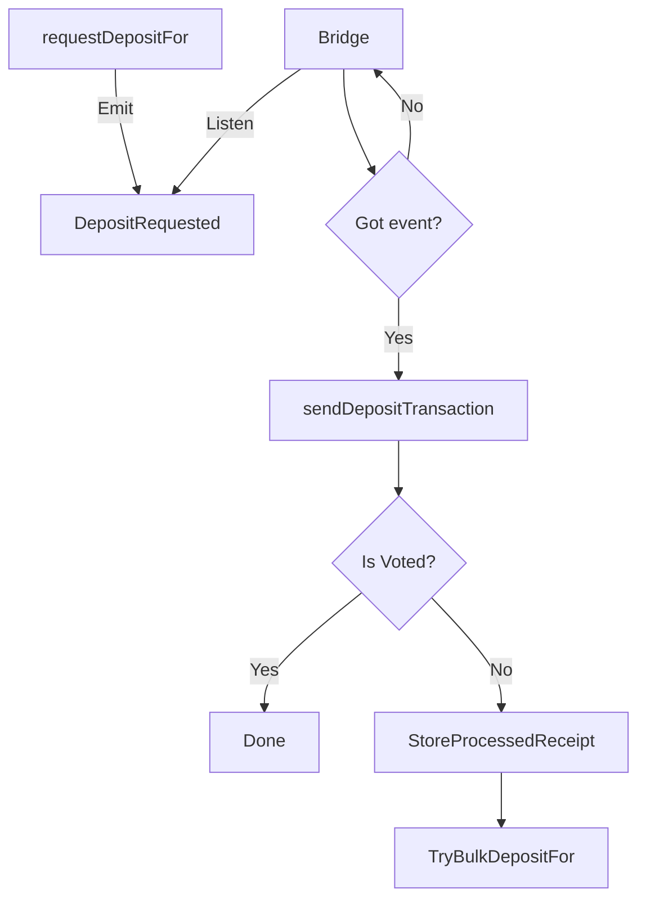
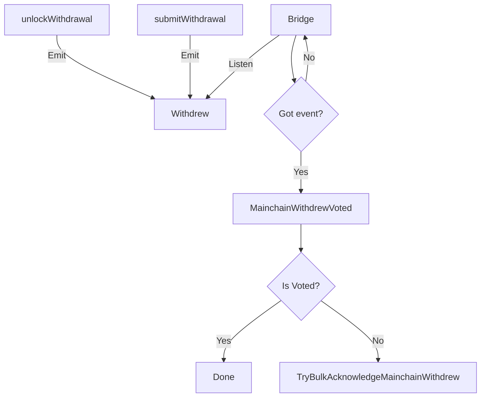
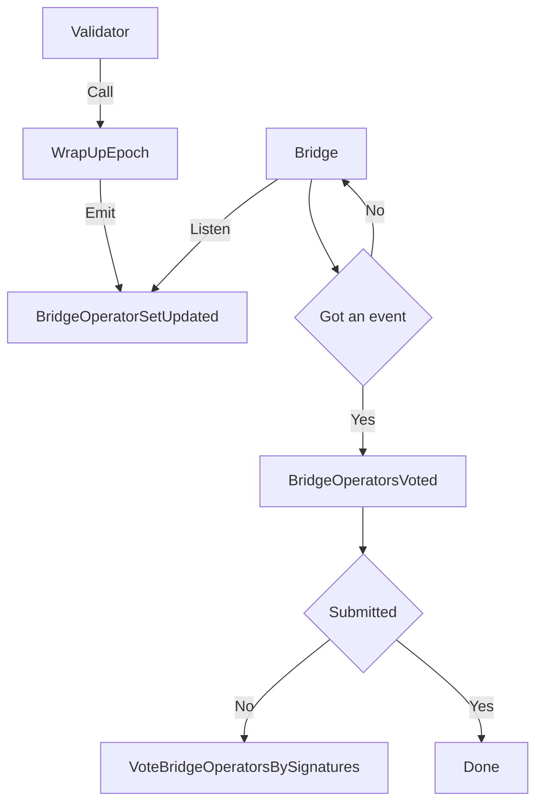
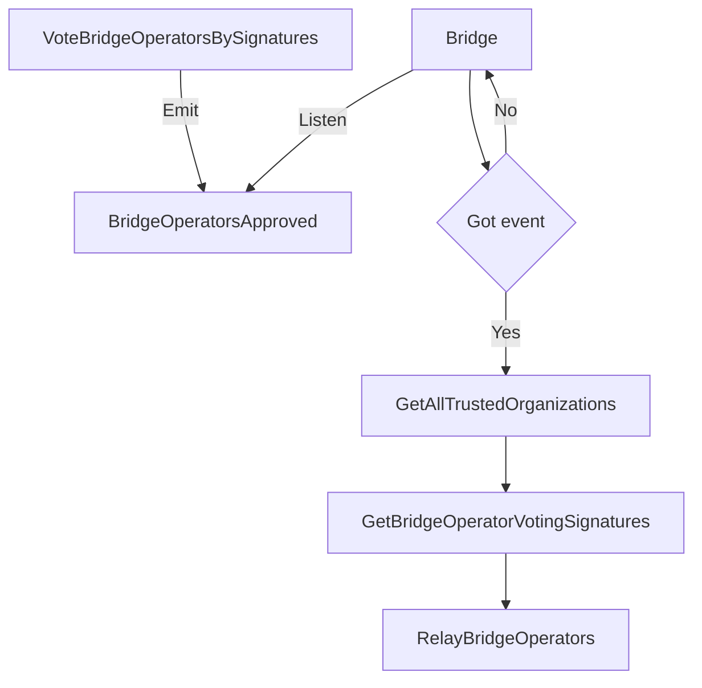

# Run a bridge operator node (mainnet)
## Requirements

- Ronin RPC URL is used to listen/trigger events from Ronin chain
- Ethereum RPC URL (Alchemy, Infura, etc.) is used to listen/trigger events from Ethereum
- Postgres DB to store events and tasks

## Install and run
### Using docker

```
cd /axie/ronin-manager  && vim docker-compose.yml
```

```
version: "3"
services:
  db:
    image: postgres:14.3
    restart: always
    command: postgres -c 'max_connections=1000'
    hostname: db
    container_name: db
    ports:
      - 127.0.0.1:5432:5432
    environment:
      POSTGRES_PASSWORD: example
    volumes:
      - ~/bridgedata-v2:/var/lib/postgresql/data
  bridge:
    image: ${BRIDGE_IMAGE}
    restart: always
    container_name: bridge
    environment:
      - RONIN_RPC=${RPC_ENDPOINT}
      - RONIN_BRIDGE_VOTER_KEY=${BRIDGE_VOTER_PRIVATE_KEY}
      - RONIN_BRIDGE_OPERATOR_KEY=${BRIDGE_OPERATOR_PRIVATE_KEY}
      - ETHEREUM_RPC=${ETHEREUM_ENDPOINT}
      - DB_HOST=db
      - DB_NAME=${DB_NAME}
      - DB_PORT=5432
      - DB_USERNAME=${DB_USERNAME}
      - DB_PASSWORD=${DB_PASSWORD}
      - VERBOSITY=${VERBOSITY}
      - CONFIG_PATH=${CONFIG_PATH}
      - RONIN_TASK_INTERVAL=${RONIN_TASK_INTERVAL}
      - RONIN_TRANSACTION_CHECK_PERIOD=${RONIN_TRANSACTION_CHECK_PERIOD}
      - RONIN_MAX_PROCESSING_TASKS=${RONIN_MAX_PROCESSING_TASKS}
      - ETHEREUM_GET_LOGS_BATCH_SIZE=${ETHEREUM_GET_LOGS_BATCH_SIZE}
    depends_on:
      - db
```

3. Create an `.env` file with the following contents, replacing the `insert-your-` placeholders with your credentials.

```
vim .env
```

```
# User for postgres account.
DB_USERNAME=postgres
# Password for postgres account.
DB_PASSWORD=example
DB_NAME=bridge
# Database to store oracle.
POSTGRES_DB=bridge
# Password to protect your private key.
PASSWORD=123456

RPC_ENDPOINT=your-rpc-endpoint
ETHEREUM_ENDPOINT=https://eth-mainnet.g.alchemy.com/v2/your-ethereum-endpoint
CONFIG_PATH=config.mainnet.json
BRIDGE_IMAGE=ghcr.io/axieinfinity/bridge:v0.2.2-da196d9
VERBOSITY=3

RONIN_TASK_INTERVAL=3
RONIN_TRANSACTION_CHECK_PERIOD=50
RONIN_MAX_PROCESSING_TASKS=200
ETHEREUM_GET_LOGS_BATCH_SIZE=100

# Private key of the bridge operator, used for acknowledging deposit and withdrawal events to facilitate asset transfers between Ronin and other EVM-based chains, without 0x.
BRIDGE_OPERATOR_PRIVATE_KEY=insert-your-operator-private-key

# Private key of the bridge voter (also known as "governor") without 0x. Only governor roles need to set this, otherwise you can leave it blank. 
BRIDGE_VOTER_PRIVATE_KEY=insert-your-voter-private-key
```

There is a `docker-compose.yaml` file in `docker` directory. Modify `.env` file and run `bridge` with the following command
```
docker-compose -f docker/docker-compose.yaml --env-file .env up -d
```

## Configuration
The config file can be found in the `config` directory. There are 2 main components in the configuration: listeners and database

### listeners (object)
List all chains that Bridge is listening to. Each name reflects a specific function defined [here](https://github.com/axieinfinity/bridge-v2/blob/master/internal/init_listeners.go).

For example `Ronin` reflects with function `InitRonin`

Therefore, do not change the name, otherwise, the program cannot run properly.

#### 1. chainId:
- type: `hex string`

Chain's identity (ronin: 0x7e4, ethereum: 0x1)

#### 2. rpcUrl:
- type: `string`

RPC URL of chain which is used to query new events or submit transactions to.

#### 3. blockTime:
- type: `number`
- unit: `seconds`

The time of a new block is generated which is used periodically to listen to new events from the new block,

#### 4. safeBlockRange: 
- type: `number`
- unit: `blocks`

Safe block range which guarantees that reorg cannot happen.

#### 5. maxTasksQuery:
- type: `number`

Maximum number of pending/processing tasks queried from the database

#### 6. transactionCheckPeriod:
- type: `number`
- unit: `seconds`

Period of checking whether a transaction is mined or not by querying its transaction's receipt. If a receipt is found,
it will try 3 more times to ensure the transaction is not replaced because of reorg.

#### 7. secret:
- type: `object`

Stores private key of validator and relayer. These fields can be empty and passed via environment variables
through 2 variables: `RONIN_VALIDATOR_KEY`, `RONIN_RELAYER_KEY` and Ethereum are: `ETHEREUM_VALIDATOR_KEY`, `ETHEREUM_RELAYER_KEY`
##### syntax: `<key>`
##### example: `xxxx4563e6591c1eba4b932a3513006cb5bcd1a6f69c32295dxxxx`

#### 8. fromHeight:
- type: `number`
- unit: `blocks`

Initially, Bridge uses this property to load data from this block. After that, Bridge will store the latest processed block in `processed_block` table and use the value from this table to continue.

#### 9. processWithinBlocks:
- type: `number`
- unit: `blocks`

This property guarantees that Bridge does not process too far. Specifically, when `latestBlock - processWithinBlocks > fromHeight`, bridge `latestBlock - processWithinBlocks` instead of `fromHeight` to process.

#### 10. contracts
- type: `record<string, address>`

Stores a map (pair) of names and contact addresses, which can be used during processing tasks or jobs of a listener. For example, in `Ronin` listener, 2 contracts which are Ronin Gateway contract (at `Gateway`) and Ethereum Gateway contract (at `EthGateway`) are used:
```json
{
  "Gateway": "0x03d1F13c7391F6B5A651143a31034cf728A93694",
  "EthGateway": "0x3b6371EB912bFd5C0E249A16000ffbC6B881555A"
}
```

#### 11. subscriptions
- type: `object`

Includes all subscriptions bridge is observing in a listener. Each subscription contains the subscription name and subscription config.
- `to`: Indicates receiver/contract address that bridge uses as one of conditions to trigger a subscription
- `type`: There are 2 types, `0` is `transaction event` and `1` is `log's event`
- `handler`: Define contract and event that we want to listen
  - `contract`: Contract name. This must be defined on repo [Bridge Contracts](https://github.com/axieinfinity/bridge-contracts/blob/master/main.go#L13-L20)
  - `name`: The event name
- `callbacks`: List all callbacks function when data is decoded. This is a map (pair) where the key is listener's name and value is the function that is called in that listener. For example:

```json5
{
  "to": "0xA8D61A5427a778be28Bd9bb5990956b33385c738",
  "type": 1, // Listen log's event
  "handler": {
    "contract": "RoninGateway",
    "name": "MainchainWithdrew"
  },
  "callbacks": {
    "Ronin": "StoreMainchainWithdrawCallback"
  }
}
```

Bridge will trigger the function `StoreMainchainWithdrawCallback` in `RoninListener`

#### Example
For example, Bridge will listen to event `Welcomed` which is defined on contract `Hello` 
and submit the data to `HelloEth` contract via method `SubmitFromRonin`
```json5
{
  "MainchainWithdrewSubscription": {
    "to": "0xA8D61A5427a778be28Bd9bb5990956b33385c738",
    "type": 1,
    "handler": {
      "contract": "RoninGateway", // The contract name, it must be defined on [Bridge Contracts](https://github.com/axieinfinity/bridge-contracts/blob/master/main.go#L13-L20) first.
      "name": "Welcome" // The event is listening
    },
    "callbacks": {
      "Ronin": "WelcomeCallback" // Execute the callback on Ronin chain
    }
  },
}
```
On `litenser/ronin.go` add the following method
```go
package listener

func (l *RoninListener) WelcomeCallback(fromChainId *big.Int, tx bridgeCore.Transaction, data []byte) error {
	// Unpack event data
	roninEvent := new(hello.WelcomeEvent)
	roninGatewayAbi, err := hello.GatewayMetaData.GetAbi()

	// Since the data argument was the log's marshalled in bytes, so it must be unmarshalled
	// before being use
	if err = l.utilsWrapper.UnpackLog(*roninGatewayAbi, roninEvent, "Welcome", data); err != nil {
		return err
	}

    chainId, err := l.GetChainID()
  
	// Create a new task
    t := &models.Task{
        ChainId:         hexutil.EncodeBig(chainId),
        FromChainId:     hexutil.EncodeBig(fromChainId),
        FromTransaction: tx.GetHash().Hex(),
        Type:            task.WELCOME_TASK, // defined in task/main.go
        Data:            common.Bytes2Hex(data),
        Retries:         0,
        Status:          task.STATUS_PENDING,
        LastError:       "",
        CreatedAt:       time.Now().Unix(),
    }
	
	// Get the store API to save the task to database
	return l.bridgeStore.GetTaskStore().Save(withdrawalTask)
}
```
Then create a method `welcomeTask` in `task/task.go`
```go
package task

func (r *task) welcomeTask(task *models.Task) (doneTasks, processingTasks, failedTasks []*models.Task, tx *ethtypes.Transaction) {
	// create caller
	transactor, err := helloEth.NewHelloEth(common.HexToAddress(r.contracts[HELLO_ETH_CONTRACT]), r.ethClient)
	
    tx, err = r.util.SendContractTransaction(r.listener.GetValidatorSign(), r.chainId, func(opts *bind.TransactOpts) (*ethtypes.Transaction, error) {
      return transactor.SubmitFromRonin(opts)
    })
	doneTasks = append(doneTasks, task)
	return
}
```
Finally, add it to `send` method:
```go
package task

func (r *task) send() {
	log.Info("[task] Sending transaction", "type", r.taskType)
	switch r.taskType {
	case VOTE_BRIDGE_OPERATORS_TASK:
		r.sendTransaction(r.voteBridgeOperatorsBySignature)
	case RELAY_BRIDGE_OPERATORS_TASK:
		r.sendTransaction(r.relayBridgeOperators)
	}
}

```

### Subscriptions

#### MainchainWithdrewSubscription

#### WithdrawalRequestedSubscription
Request validators sign withdrawal transaction


#### WithdrawalSignaturesRequestedSubscription
Request validators sign withdrawal transaction again


#### DepositRequestedSubscription
When a user deposit ETH on Ethereum to contract. Bridge will listen this event and send it to Ronin

#### WithdrewSubscription
When a user withdraw ETH from contract. Bridge will listen this event and send it to Ronin


#### BridgeOperatorSetUpdatedSubscription
At the end of each epoch, validators call `wrapUpEpoch` of `ValidatorSet` contract to update list validator set.
It emits an event `BridgeOperatorSetUpdated(uint256 period, []address operators)`. All trusted nodes must listen this
event, vote by signing typed data and submit it to `RoninGovernanceAdmin` contract. 


#### BridgeOperatorsApprovedSubscription
After trusted nodes submitted vote's signature to `RoninGovernanceAdmin`. Relayer needs to 
call `GetAllTrustedOrganizations` to get all trusted nodes, sort it as ascending. Then call `GetBridgeOperatorVotingSignatures`
to get a list signatures that submitted on Ronin. Finally, relayer submits these signatures to
`MainchainGovernanceAdmin` through `RelayBridgeOperators` method.


### Database
Database configuration is defined within the key `database`. Basic properties include host, port, user, password and dbName.

```json5
{
  "database": {
    "host": "localhost", // Database host name
    "user": "postgres", // Database username
    "password": "example", // Database password
    "dbName": "bridge", // Database name
    "port": 5432 // Database port
  }
}
```
