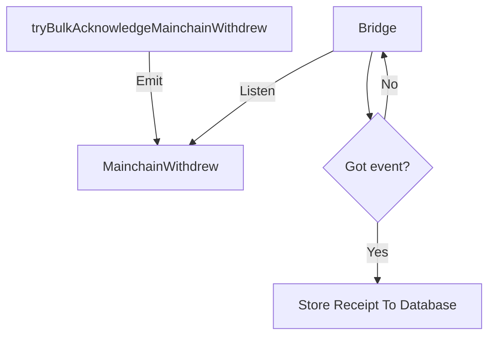
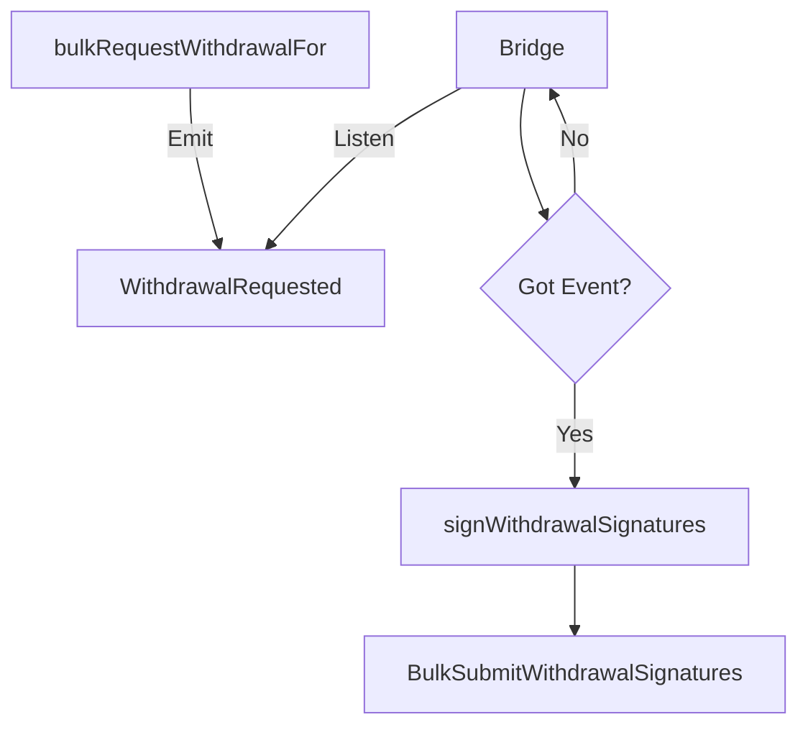
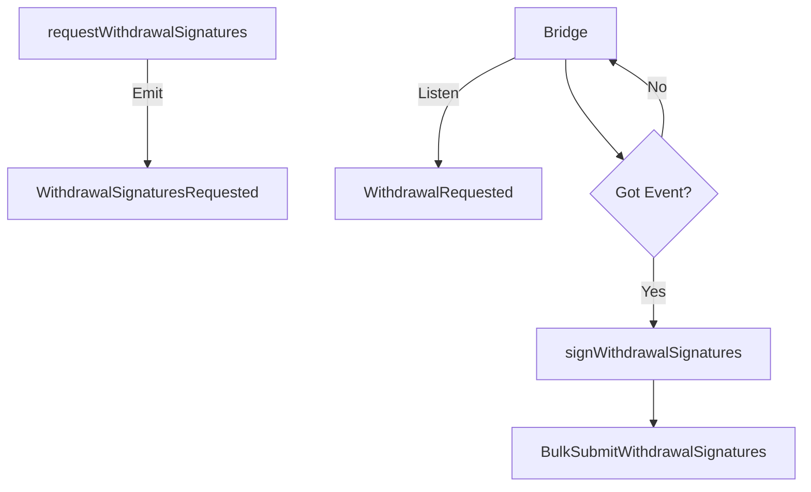
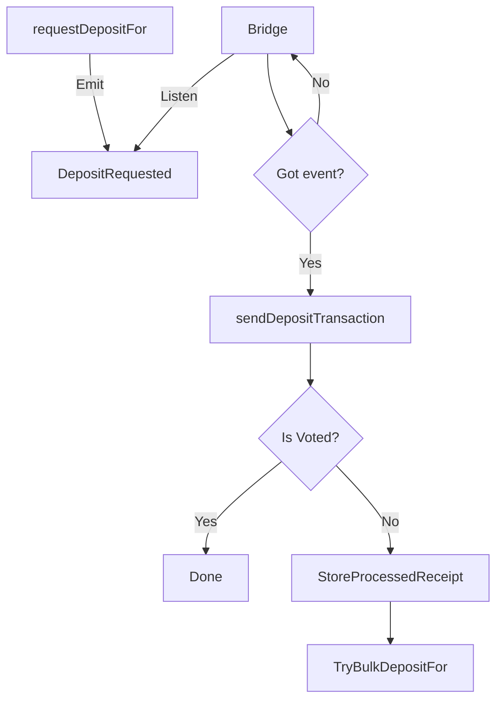
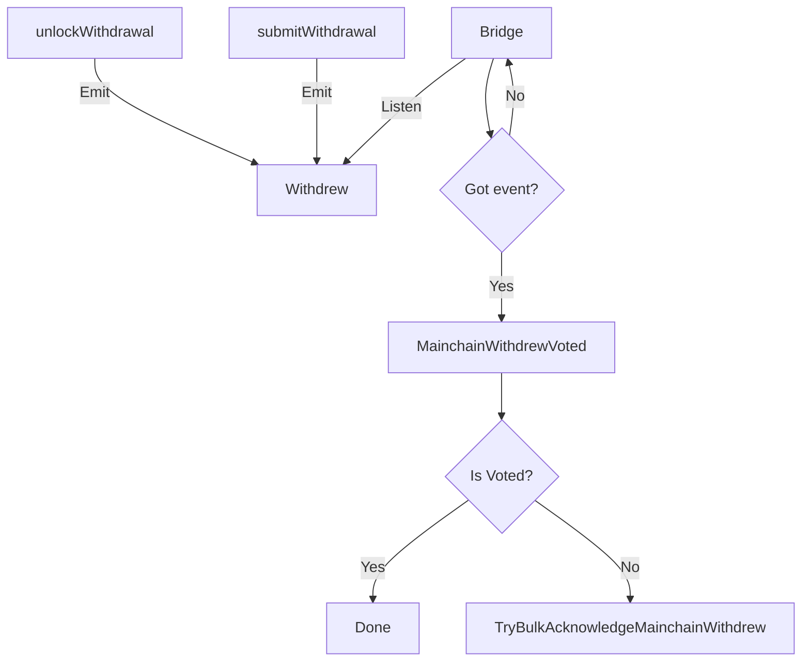
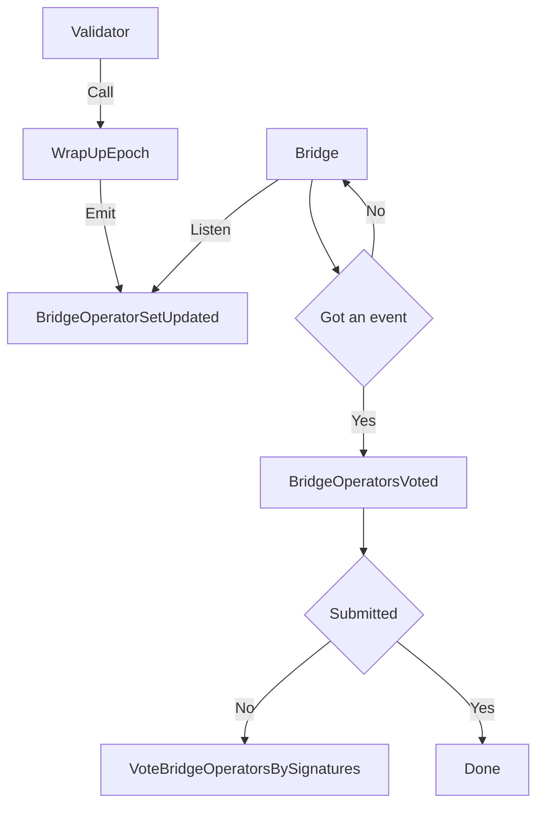
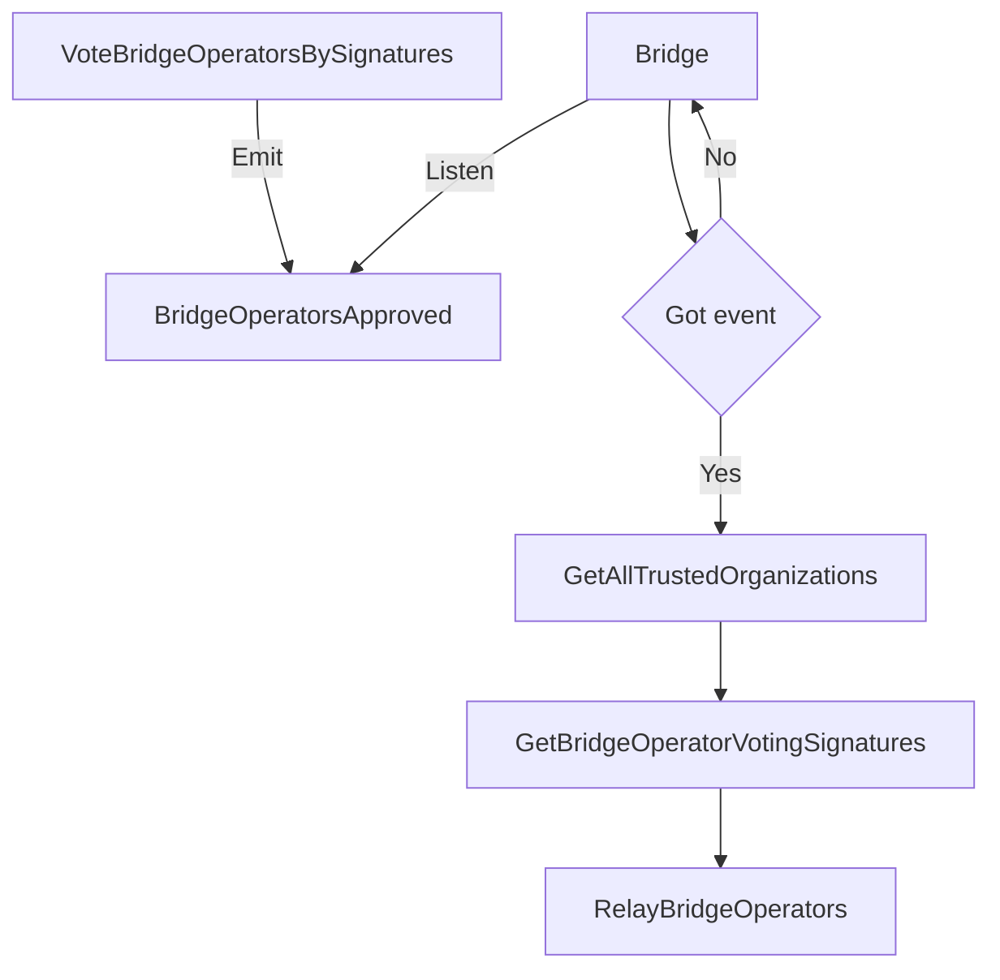

# Run a bridge operator node
This page describes how to set up and run a bridge operator node on testnet.

## Prerequisites
* Ronin RPC (remote procedure call) URL to listen for events from Ronin chain and send events to Ronin chain.
* Ethereum RPC URL (Alchemy, Infura, and others) to listen for events from Ethereum chain and send events to Ethereum.
* Postgres database to store events and tasks.

## Set up and run
1. In your working directory, create subdirectories by running the following commands:

```
mkdir -p /axie/ronin-manager
mkdir -p ~/bridgedata-v2
```

2. Navigate to the `ronin-manager` directory:
   
```
cd /axie/ronin-manager
```

3. Create a `docker-compose` file:

```
vim docker-compose.yml
```

4. Paste the following contents into the file:

```
version: "3"
services:
  db:
    image: postgres:14.3
    restart: always
    command: postgres -c 'max_connections=1000'
    hostname: db
    container_name: db
    ports:
      - 127.0.0.1:5432:5432
    environment:
      POSTGRES_PASSWORD: example
    volumes:
      - ~/bridgedata-v2:/var/lib/postgresql/data
  bridge:
    image: ${BRIDGE_IMAGE}
    restart: always
    container_name: bridge
    environment:
      - RONIN_RPC=${RPC_ENDPOINT}
      - RONIN_BRIDGE_VOTER_KEY=${BRIDGE_VOTER_PRIVATE_KEY}
      - RONIN_BRIDGE_OPERATOR_KEY=${BRIDGE_OPERATOR_PRIVATE_KEY}
      - ETHEREUM_RPC=${ETHEREUM_ENDPOINT}
      - DB_HOST=db
      - DB_NAME=${DB_NAME}
      - DB_PORT=5432
      - DB_USERNAME=${DB_USERNAME}
      - DB_PASSWORD=${DB_PASSWORD}
      - VERBOSITY=${VERBOSITY}
      - CONFIG_PATH=${CONFIG_PATH}
      - RONIN_TASK_INTERVAL=${RONIN_TASK_INTERVAL}
      - RONIN_TRANSACTION_CHECK_PERIOD=${RONIN_TRANSACTION_CHECK_PERIOD}
      - RONIN_MAX_PROCESSING_TASKS=${RONIN_MAX_PROCESSING_TASKS}
      - ETHEREUM_GET_LOGS_BATCH_SIZE=${ETHEREUM_GET_LOGS_BATCH_SIZE}
    depends_on:
      - db
```

5. Create an `.env` file:

```
vim .env
```

6. Paste the following contents into the file, replacing the `insert-...` placeholder values with your own:

```
# User for postgres account.
DB_USERNAME=postgres
# Password for postgres account.
DB_PASSWORD=example
DB_NAME=bridge
# Database to store oracle.
POSTGRES_DB=bridge
# Password to protect your private key.
PASSWORD=123456

RPC_ENDPOINT=your-rpc-endpoint
ETHEREUM_ENDPOINT=https://eth-goerli.g.alchemy.com/v2/your-ethereum-endpoint
CONFIG_PATH=config.testnet.json
BRIDGE_IMAGE=ghcr.io/axieinfinity/bridge:v0.2.3-56f7328
VERBOSITY=3

RONIN_TASK_INTERVAL=3
RONIN_TRANSACTION_CHECK_PERIOD=50
RONIN_MAX_PROCESSING_TASKS=200
ETHEREUM_GET_LOGS_BATCH_SIZE=100

# Private key of the bridge operator, used for acknowledging deposit and withdrawal events to facilitate asset transfers between Ronin and other EVM-based chains, without 0x.
BRIDGE_OPERATOR_PRIVATE_KEY=insert-your-operator-private-key

# Private key of the bridge voter (also known as "governor") without 0x. Only governor roles need to set this, otherwise you can leave it blank. 
BRIDGE_VOTER_PRIVATE_KEY=insert-your-voter-private-key
```

7. Start the node:

```
docker-compose up -d
```

After a few minutes, go to the [stats page](https://saigon-stats.roninchain.com/) to check the status of your node. If it's green, the node is connected and up to date with the network.

## Configuration
The configuration file is located in the `config` directory. There are two main objects in the configuration: `listeners` and `database`.

### listeners
Lists all chains that the bridge is listening to. Each `name` reflects a specific function defined in https://github.com/axieinfinity/bridge-v2/blob/master/internal/main.go. For example, `Ronin` reflects the function `InitRonin`, while `Ethereum` points to `InitEthereum`. Therefore, don't change the names, otherwise the program can't run correctly.

#### chainId
Chain's identity (ronin: 0x7e4, ethereum: 0x1).

Type: `hex string`

#### rpcUrl
RPC URL of the chain that is used to query new events or submit transactions to.

Type: `string`

#### blockTime
The time a new block is generated, used periodically to listen to new events from the new block.

Type: `number`

Unit: `seconds`

#### safeBlockRange
Safe block range that guarantees that a reorg can't happen. 

Type: `number`

Unit: `blocks`

#### maxTasksQuery
Maximum number of pending and processing tasks queried from the database.

Type: `number`

#### transactionCheckPeriod
Period of checking whether a transaction is mined or not by querying
its receipt. If a receipt is found, the system tries three more times
to ensure the transaction isn't replaced because of a reorg.

Type: `number`

Unit: `seconds`

#### secret
Stores private key of the validator and the relayer. These fields can be empty and passed via the environment variables: `BRIDGE_OPERATOR_PRIVATE_KEY`, `BRIDGE_VOTER_PRIVATE_KEY` for Ronin, and `ETHEREUM_ENDPOINT` for Ethereum.

Type: `object`

Example: `xxxx4563e6591c1eba4b932a3513006cb5bcd1a6f69c32295dxxxx`

#### fromHeight
Initially, the bridge uses this property to load data from this block. After that, the bridge stores the latest processed block in the `processed_block` table and uses the value from this table to continue.

Type: `number`

Unit: `blocks`

#### processWithinBlocks
This property guarantees that the bridge doesn't process too far. Specifically, when `latestBlock - processWithinBlocks > fromHeight`, bridge `latestBlock - processWithinBlocks` instead of `fromHeight` to process.

Type: `number`

Unit: `blocks`

#### contracts
Stores a map (pair) of names and contact addresses, which can be used during processing tasks or jobs of a listener.

Type: `record<string, address>`

Example:

In `Ronin` listener, two contracts—Ronin Gateway (at `Gateway`) and Ethereum Gateway (at `EthGateway`)—are used:

```json
{
  "Gateway": "0x03d1F13c7391F6B5A651143a31034cf728A93694",
  "EthGateway": "0x3b6371EB912bFd5C0E249A16000ffbC6B881555A"
}
```

#### subscriptions
Includes all subscriptions that the bridge is observing in a listener. Each subscription contains the subscription name and subscription config.
* `to`: Indicates receiver/contract address that the bridge uses as one of the conditions to trigger a subscription.
* `type`: There are two types: `0` is `transaction event` and `1` is `log's event`.
* `handler`: Defines the contract and event that you want to listen to.
  * `contract`: The contract name. It must be defined in the [bridge contracts](https://github.com/axieinfinity/bridge-contracts/blob/master/main.go#L13-L20) repository.
  * `name`: The event name.
* `callbacks`: Lists all callback functions when data is decoded. This is a map (pair) where the key is the listener's name and the value is the function that is called in that listener. 

Type: `object`

Example:

```json5
{
  "to": "0xA8D61A5427a778be28Bd9bb5990956b33385c738",
  "type": 1, // Listen to the log's event
  "handler": {
    "contract": "RoninGateway",
    "name": "MainchainWithdrew"
  },
  "callbacks": {
    "Ronin": "StoreMainchainWithdrawCallback"
  }
}
```

The bridge triggers the function `StoreMainchainWithdrawCallback` in `RoninListener`.

#### Example
Suppose that the bridge listens to the `Welcome` event, which is defined in the
`Hello` contract, and submits the data to the `HelloEth` contract via the
method `SubmitFromRonin`.

```json5
{
  "MainchainWithdrewSubscription": {
    "to": "0xA8D61A5427a778be28Bd9bb5990956b33385c738",
    "type": 1,
    "handler": {
      "contract": "RoninGateway", // The contract name. First, it must be defined in the [bridge contracts](https://github.com/axieinfinity/bridge-contracts/blob/master/main.go#L13-L20).
      "name": "Welcome" // The event being listened to.
    },
    "callbacks": {
      "Ronin": "WelcomeCallback" // Execute the callback on the Ronin chain.
    }
  },
}
```

In `listener/ronin.go`, add the following method:

```go
package listener

func (l *RoninListener) WelcomeCallback(fromChainId *big.Int, tx bridgeCore.Transaction, data []byte) error {
	// Unpack event data
	roninEvent := new(hello.WelcomeEvent)
	roninGatewayAbi, err := hello.GatewayMetaData.GetAbi()

	// Because the data argument was the log marshalled in bytes, it must be un-marshalled
	// before being used.
	if err = l.utilsWrapper.UnpackLog(*roninGatewayAbi, roninEvent, "Welcome", data); err != nil {
		return err
	}

    chainId, err := l.GetChainID()
  
	// Create a new task.
    t := &models.Task{
        ChainId:         hexutil.EncodeBig(chainId),
        FromChainId:     hexutil.EncodeBig(fromChainId),
        FromTransaction: tx.GetHash().Hex(),
        Type:            task.WELCOME_TASK, // Defined in task/main.go
        Data:            common.Bytes2Hex(data),
        Retries:         0,
        Status:          task.STATUS_PENDING,
        LastError:       "",
        CreatedAt:       time.Now().Unix(),
    }
	
	// Get the store API to save the task to database.
	return l.bridgeStore.GetTaskStore().Save(withdrawalTask)
}
```

Then in `task/task.go`, create a `welcomeTask` method.

```go
package task

func (r *task) welcomeTask(task *models.Task) (doneTasks, processingTasks, failedTasks []*models.Task, tx *ethtypes.Transaction) {
	// create caller
	transactor, err := helloEth.NewHelloEth(common.HexToAddress(r.contracts[HELLO_ETH_CONTRACT]), r.ethClient)
	
    tx, err = r.util.SendContractTransaction(r.listener.GetValidatorSign(), r.chainId, func(opts *bind.TransactOpts) (*ethtypes.Transaction, error) {
      return transactor.SubmitFromRonin(opts)
    })
	doneTasks = append(doneTasks, task)
	return
}
```

Finally, add it to the `send` method:

```go
package task

func (r *task) send() {
	log.Info("[task] Sending transaction", "type", r.taskType)
	switch r.taskType {
	case VOTE_BRIDGE_OPERATORS_TASK:
		r.sendTransaction(r.voteBridgeOperatorsBySignature)
	case RELAY_BRIDGE_OPERATORS_TASK:
		r.sendTransaction(r.relayBridgeOperators)
	}
}
```

### Subscriptions
#### MainchainWithdrewSubscription



#### WithdrawalRequestedSubscription
Request validators to sign a withdrawal transaction.



#### WithdrawalSignaturesRequestedSubscription
Request validators to sign a withdrawal transaction again.



#### DepositRequestedSubscription
When a user deposits ETH to a contract on Ethereum, the bridge listens to this event and sends it to Ronin.



#### WithdrewSubscription
When a user withdraws ETH from a contract, the bridge listens to this event and sends it to Ronin.



#### BridgeOperatorSetUpdatedSubscription
At the end of each epoch, validators call the `wrapUpEpoch` method of
the `ValidatorSet` contract to update the validator set.
It emits an event
`BridgeOperatorSetUpdated(uint256 period, []address operators)`.
All Governing Validator nodes must listen to this event,
vote by signing typed data,
and submit it to the `RoninGovernanceAdmin` contract.



#### BridgeOperatorsApprovedSubscription
After a Governing Validator node submits a vote's signature to `RoninGovernanceAdmin`, the bridge operator needs to 
call `GetAllTrustedOrganizations` to get all Governing Validator nodes and sort them in the ascending order. Then call `GetBridgeOperatorVotingSignatures`
to get a list of signatures that are submitted on Ronin. Finally, the bridge operator submits these signatures to
`MainchainGovernanceAdmin` through the `RelayBridgeOperators` method.



### Database
Database configuration is defined within the `database` key. Basic properties include `host`, `port`, `user`, `password`, and `dbName`.

```json5
{
  "database": {
    "host": "localhost", // Database host name
    "user": "postgres", // Database username
    "password": "example", // Database password
    "dbName": "bridge", // Database name
    "port": 5432 // Database port
  }
}
```
