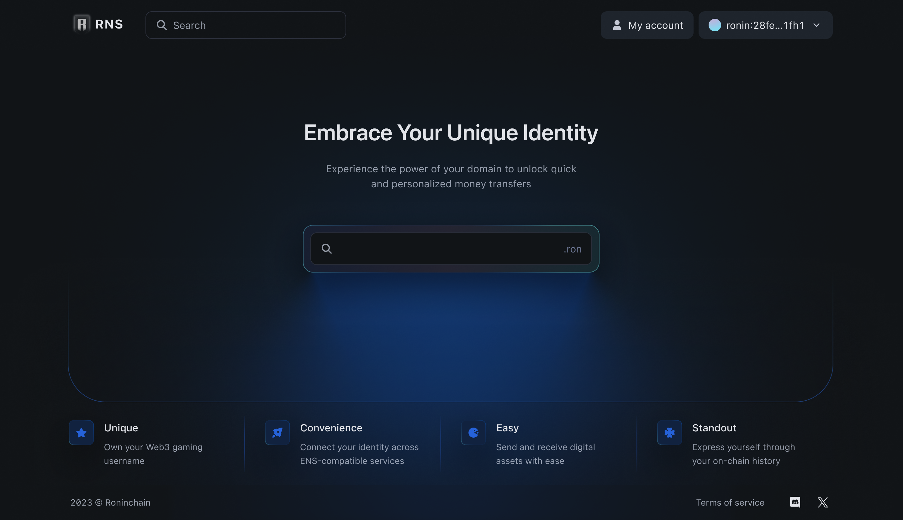
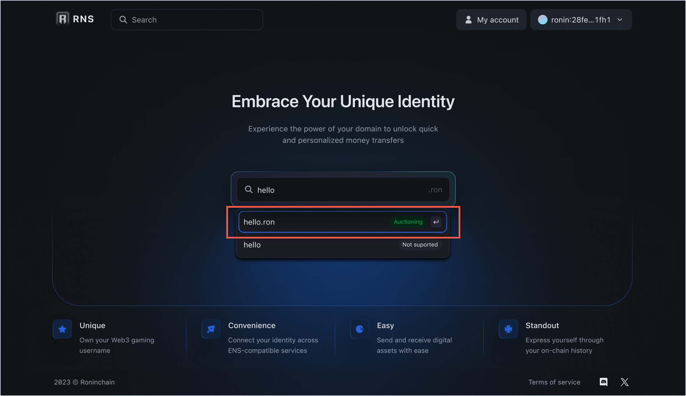
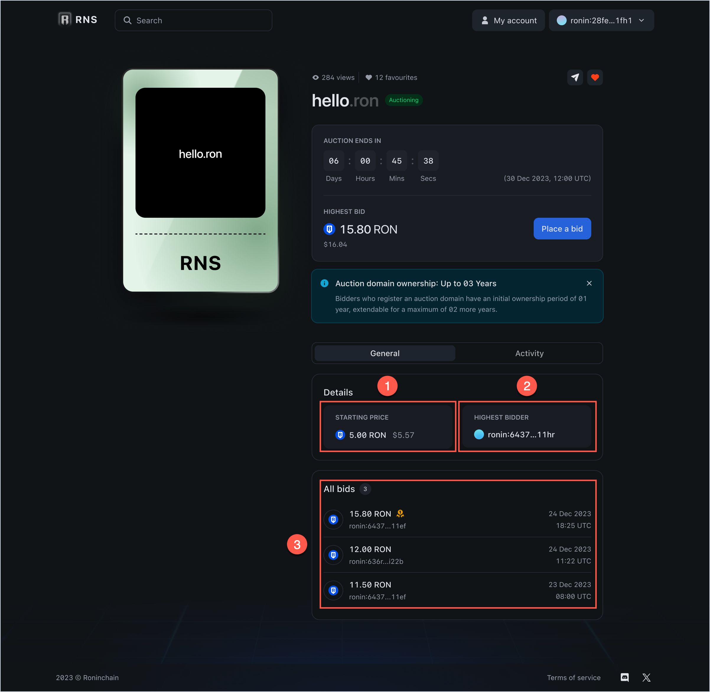
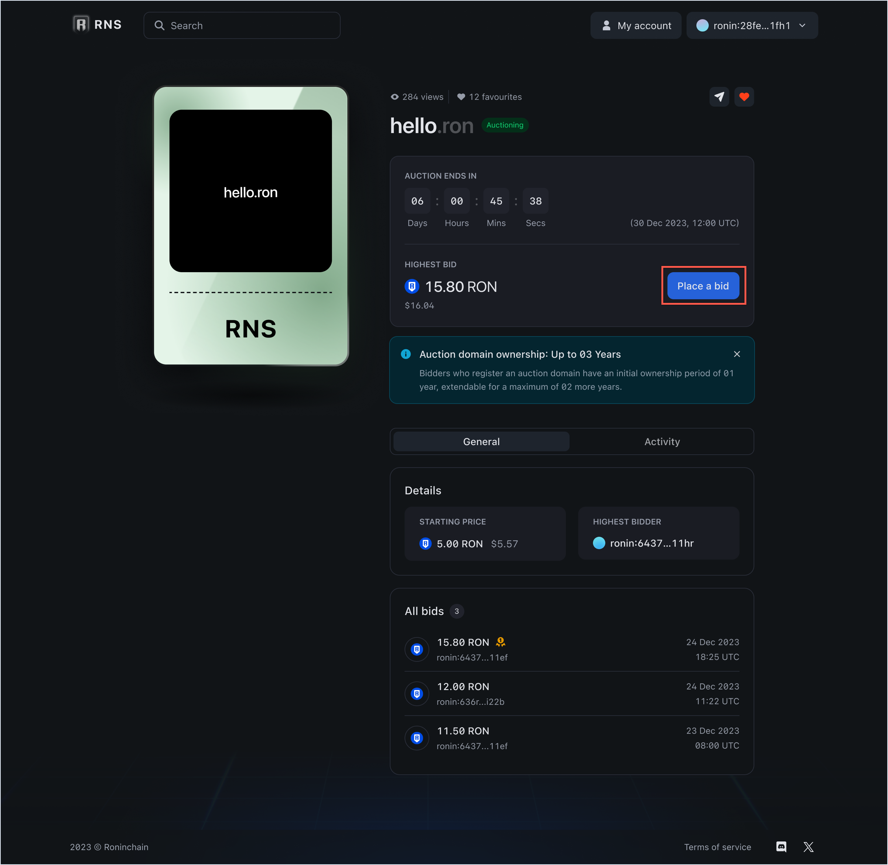
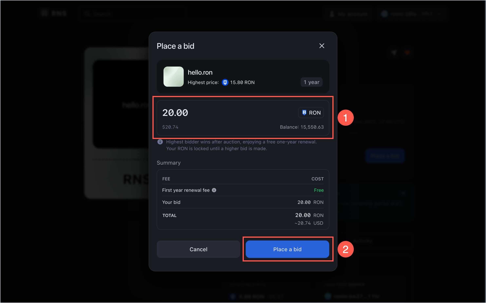
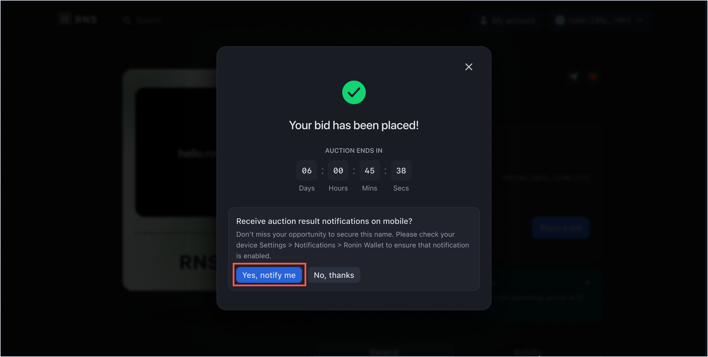

## Overview

This guide shows how to buy a high-demand `.ron` domain name at an auction.

In Ronin Name Service (RNS), auctioned names are unregistered names that may receive large amounts of interest, such as `buy.ron` and `insurance.ron`. Sky Mavis distributes such names at domain auctions.

Here's how a domain auction works:

* To participate in the auction, participants place bids.
* If someone outbids you during the auction, your bid is immediately refunded and you may place another bid.
* When the auction ends, the bidder with the highest bid wins. The winning bid is the domain price.
* The winner gets the domain and is exempt from renewal fees for the first year.
* After winning the name, the owner of the name can extend its registration.

### Statuses

In the RNS app, auctioned names have the following statuses:

* **Awaiting auction:** Domain name is in the auctioned list but no auction is scheduled in the near future.
* **Upcoming auction:** Domain name doesn't have a starting price yet but the auction's date is announced.
* **Auctioning:** An action is open and the domain name is open for bidding. If no one places a bid during the auction, the domain's status becomes **Awaiting auction** until another auction opens.

### Renewal fee

Following is the renewal fee range for auctioned RNS names.

| Name length | Renewal fee |
|---|---|
| 5+ characters | $5/year |
| 4 characters | $100/year |
| 3 characters | $300/year |

## Before you start

Before registering a regular domain, install [Ronin Wallet](https://wallet.roninchain.com) and create an account.

## Register an auctioned domain

1. Open the RNS app.

1. Search for the domain you want to register, and then select it to open the domain info page. You can also browse the available collections on the **Collections** page.

1. The info page displays the starting price of the domain (1), the current highest bid (2), and the history of past bids (3).

1. Click **Place a bid** to participate in the auction.
:::info Minimum bid
How much to bid is at your discretion, but there's a minimum markup of 10%, which means 10% of the starting price if you're the first bidder or 10% of the highest bid if you're not. For example, if the starting price is 5 RON, then your bid has to be least 5 RON + 10% of 5 RON = 5.5 RON.
:::

1. Enter your bid amount (1) and click **Place a bid** (2) to make payment.

1. Your bid is now placed and locked until the auction ends. If you wish to be notified about the status of your bid, click **Yes, notify me**. Make sure that notifications are enabled in Ronin Wallet on your phone.

If you win the auction, your bid is transferred to the RNS registrar and you become the owner of the domain name for 1 year. You can [extend the registration](./../../manage.md#extend-your-registration) for another 2 years for the maximum of 3 years at a time.

## Track your biddings

If you placed a bid on an RNS name at placed bids to Go to **My account > My biddings** to view all your biddings and their status. If the bid is active, then you're the leading bidder. If you're outbid, you lose the auction and the bid is refunded.

## See also

* [Manage RNS names](./../../manage.md)
