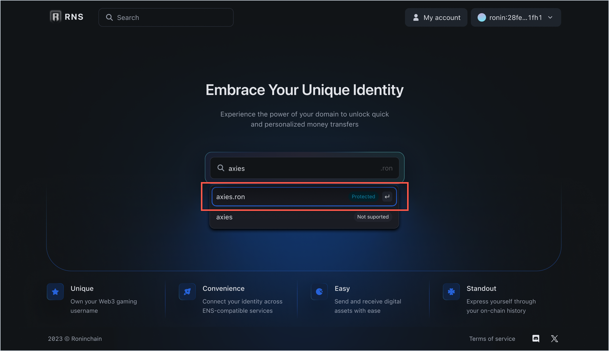
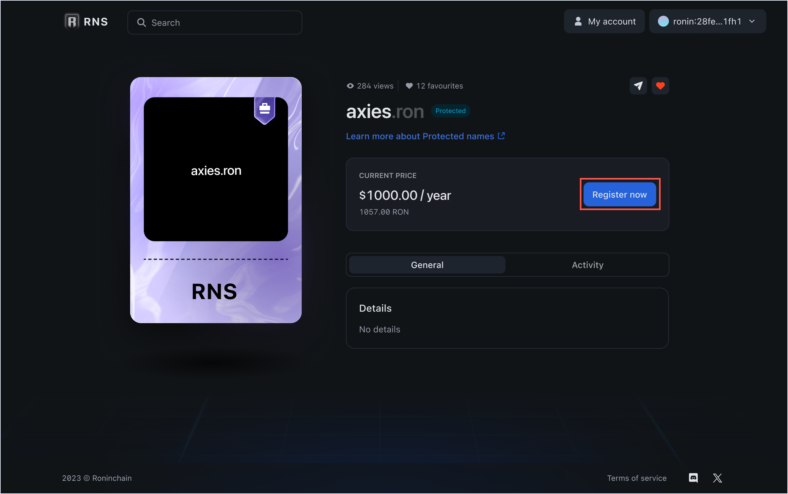

## Overview

This guide shows how to register a protected `.ron` domain name.

Protected names are reserved by Sky Mavis for its official partners and key community members, and aren't available to anyone else. Such names have the status **Protected** in the RNS app.

A protected name offers direct support from Sky Mavis to prevent anyone from squatting or misusing your name. The renewal fee for protected names is fixed and is not affected by the market.

If you're our official partner or a key community member, it's likely that we already reserved your RNS name. To claim this reserved name, follow the steps in this guide.

:::caution
The RNS name and its yearly fee is protected as long as the owner doesn't sell it or transfer it to another wallet. If they do, the name becomes a regular name, where the yearly fee is charged per the name length.
:::

## Before you start

Before registering a regular domain, install [Ronin Wallet](https://wallet.roninchain.com) and create an account.

## Register a protected domain

This section explains how to register your protected domain name in the RNS app.

1. Open the RNS app and connect the Ronin Wallet to which your domain name is mapped.

1. Search for your protected domain name, and then select it to open the domain info page.

1. The info page displays the renewal fee, domain tier, as well as other details. Click **Register now** to begin. The RNS registrar requires one transaction to register a protected name: a registration transaction.

1. Select the number of years you want to register the domain for (1). The renewal fee changes based on how many years you selected. The minimum duration for the registration is 1 year. Notice that the name is set as primary by default (2), which means that it's linked to your Ronin address.
:::tip
We recommend registering your RNS name for multiple years so that you don't lose the domain name if you forget to renew or if you run into any potential payment issues.
:::
1. Click **Confirm** and pay the renewal fee to register the domain.

1. After the registration transaction is complete, your RNS domain name is successfully registered.

You can now use this RNS name across the entire Ronin ecosystem. To view and manage all your RNS names, click **Go to My Domains**.

## See also

* [Manage RNS names](./../../manage.md)
