## Overview

After you registered your RNS name, managing it is easy. Click your connected wallet in the top right corner to open your account, and select **My domains** to access and edit all your registered domain names.

On the **My domains** tab, you can sort your RNS domains by status, domain length, expiration date, and more. Click **Manage** on a domain access the domain management page. From there, you can set the domain as primary and extend your domain registration.

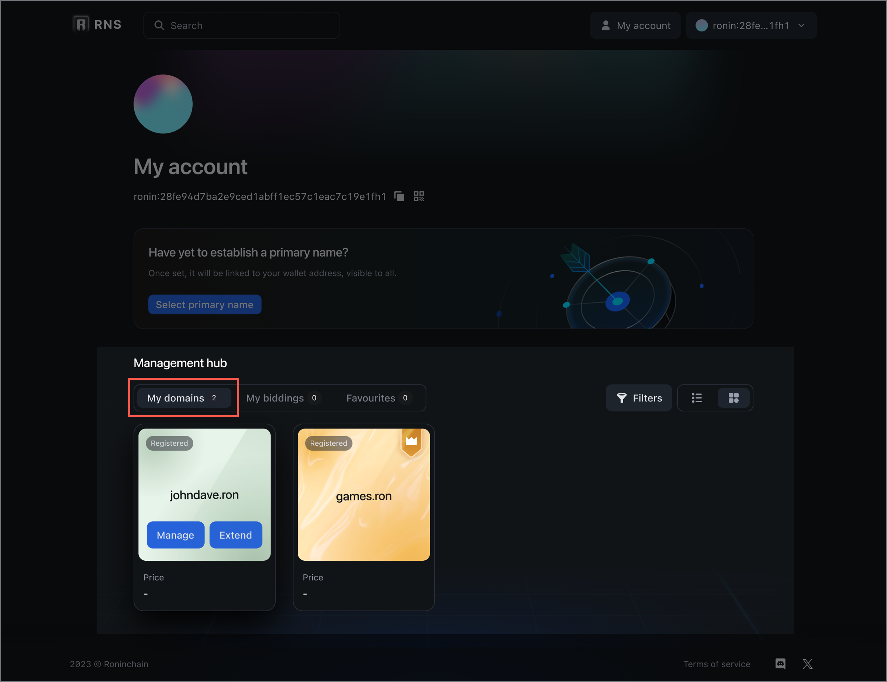

## Set primary RNS name

Your Ronin address can serve as the record address for one or multiple RNS domains. You can use one of these domains as your *primary* name on the Ronin network. A primary name is the one that appears as your identity across all Ronin ecosystem dApps supporting RNS, including the Ronin Wallet. You can have only one primary name at a time, but you can change it as needed.

### First time

To set a primary RNS name for the first time, take these steps:

1. Go to your account and click **Select primary name** at the top.
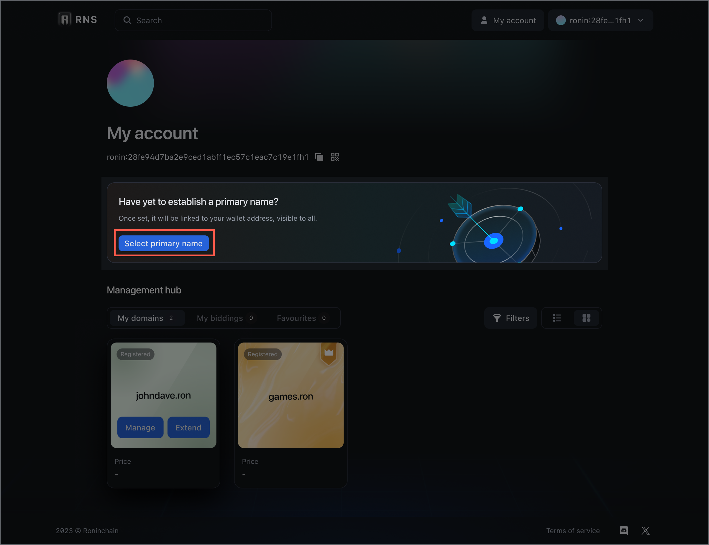
1. Select the domain you want to set as primary.

1. Click **Confirm**.

1. Sign the transaction. After that, this name is successfully set as primary.
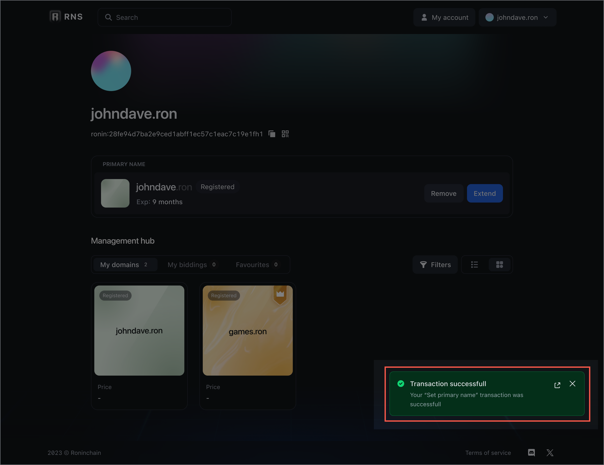

:::info
You can also set a domain name as primary during [registration](./guides/register/regular.md).
:::

### Next time

To set a primary RNS name the next time, after you purchase another RNS name, take these steps:

1. On the **My domains** tab, select the domain name that you want to set as primary, and then click **Manage** to open the domain management page.
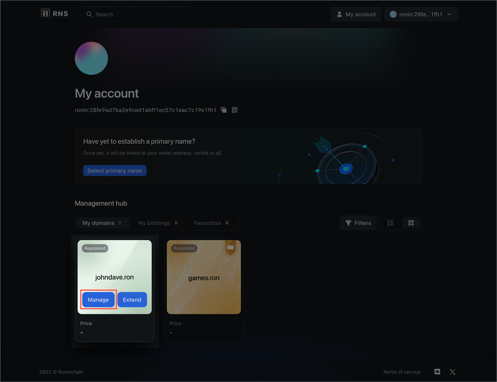
1. Click **Set as primary**.
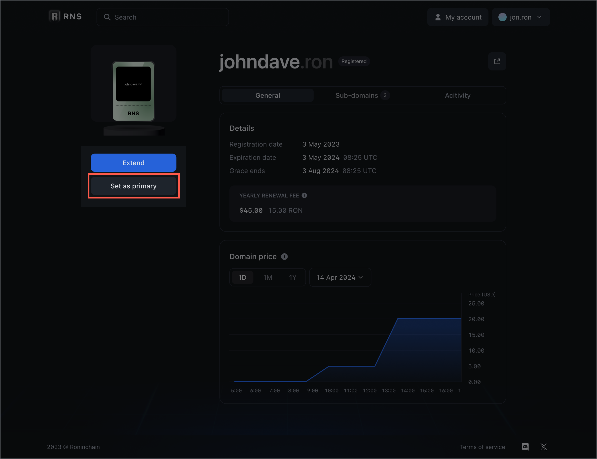
1. Click **Confirm**.

1. Sign the transaction. After that, this name is successfully set as primary.

### Remove primary name

To remove the primary name, select the domain and click **Remove**.

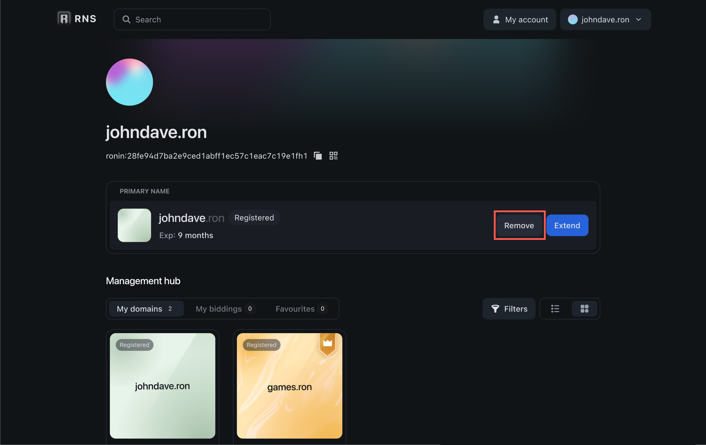

## Extend your registration

You can extend your domain registration anytime during the registration period and within 90 days after it expires, which is the 90-day grace period. During the grace period, the domain name is reserved only for its previous registrant to expand its registration. After the grace period, the name is no longer reserved and becomes open to the public to register.

:::tip
To quickly extend your primary name's registration, go to your account and click **Extend**.
:::

### Extend a regular or protected name

1. On the **My domains** tab, locate the domain name that you want to extend, and then click **Extend** to open the domain extension dialog.
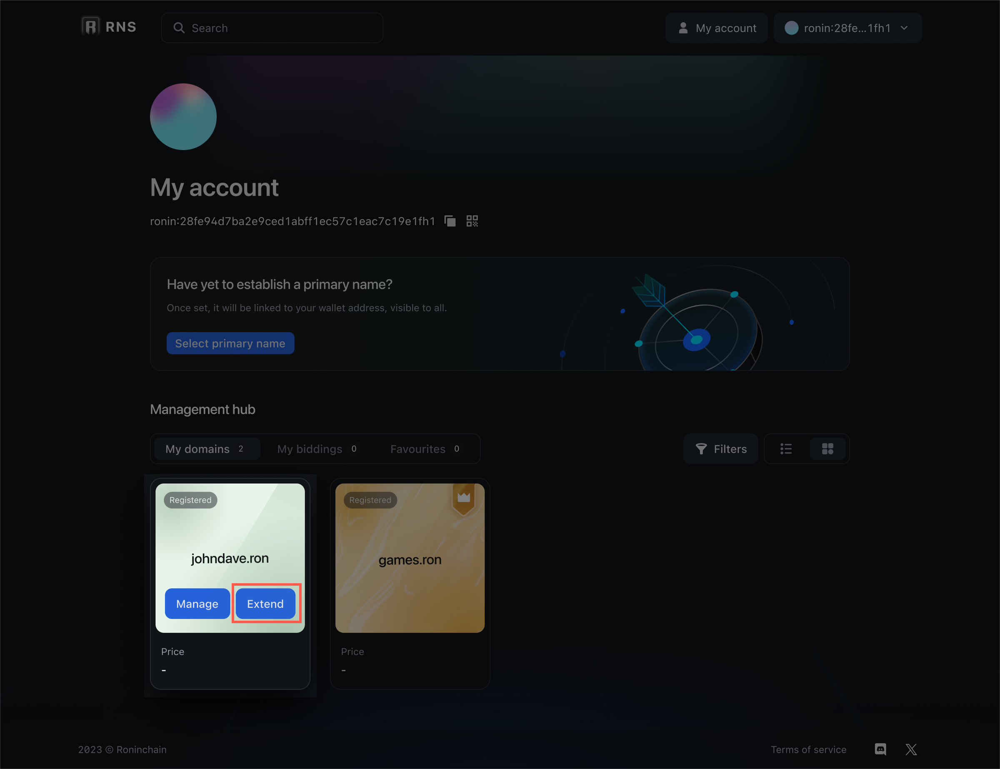
1. Select the number of years you want to extend the registration for (1). Review the total fee, which includes only the renewal fee times the requested number of years. Click **Extend** to confirm the registration extension (2).

1. Sign the transaction to make payment. Your RNS name registration is successfully extended.
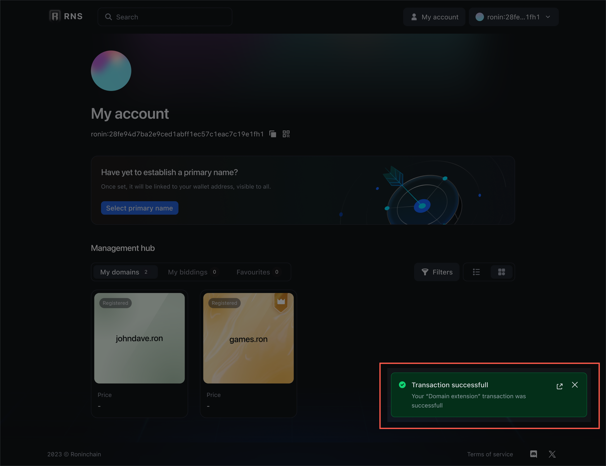

### Extend an auctioned name

1. On the **My domains** tab, locate the auctioned domain name that you want to extend, and then click **Extend** to open the domain extension dialog.
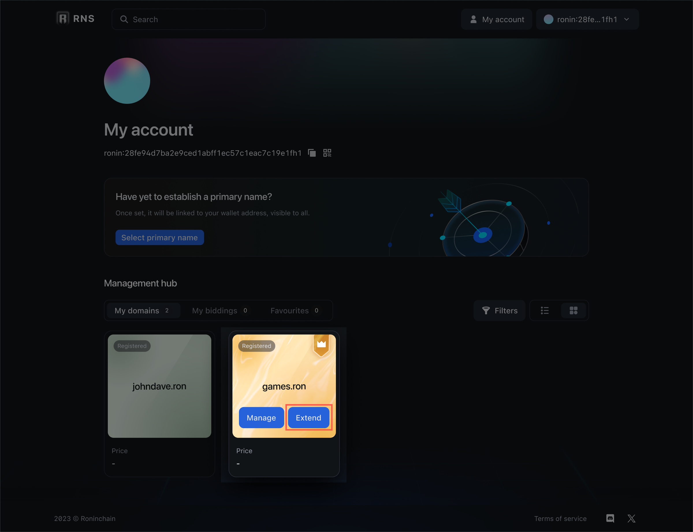
1. Select the number of years you want to extend the registration for. Extension is possible for up to 3 years at a time. For example, when you win a name at an auction, you don't need to pay the renewal fee for the first year. This means that you can extend this registration for another 2 years, to the total of 3 years.
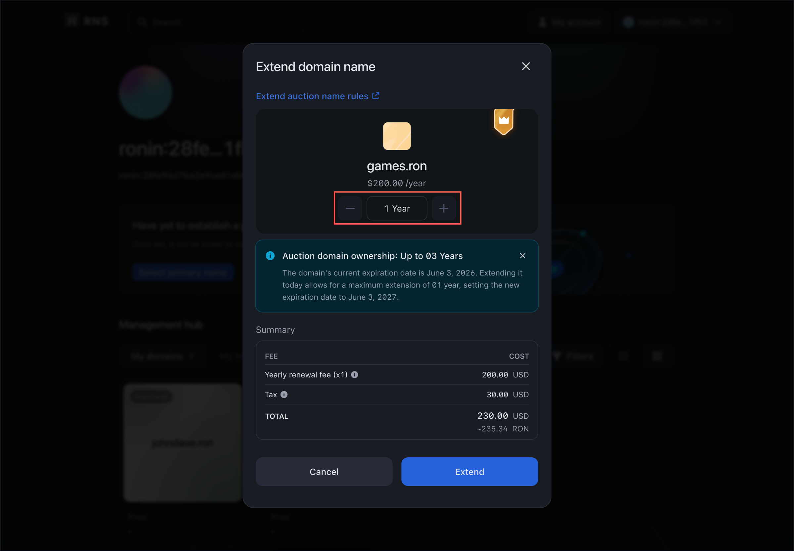
1. Review the total fee, which includes the following:
   * Renewal fee times the requested number of years.
   * 15% tax on the current domain price. **Note:** If the domain you're extending is about to expire and someone else made an offer to buy this domain at a higher price, then 15% tax is based on the price in the offer.
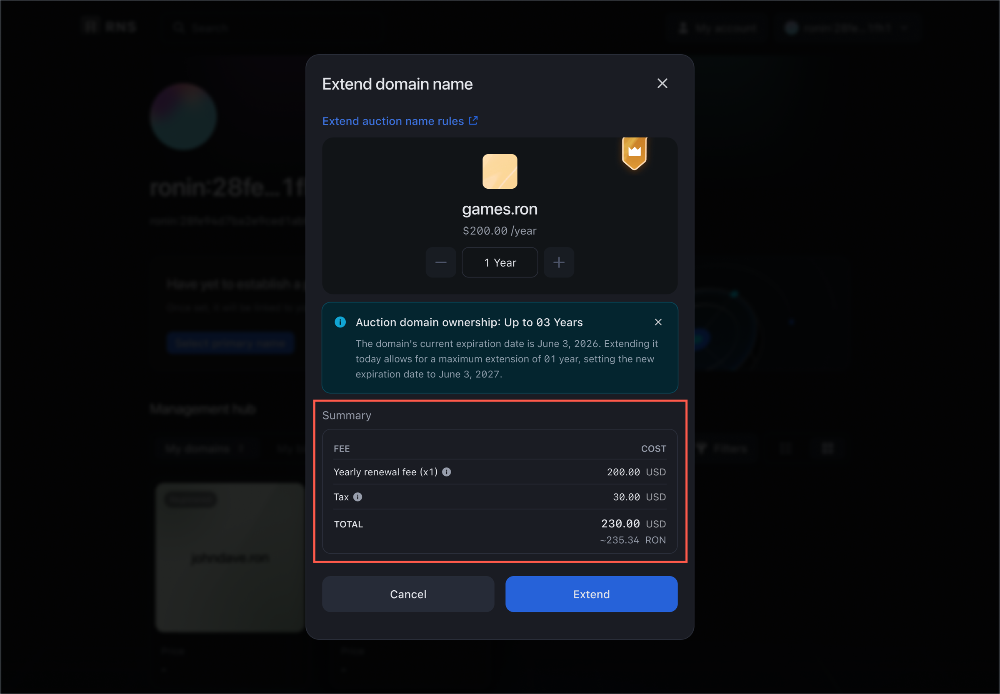
1. Click **Extend** to confirm the registration extension.
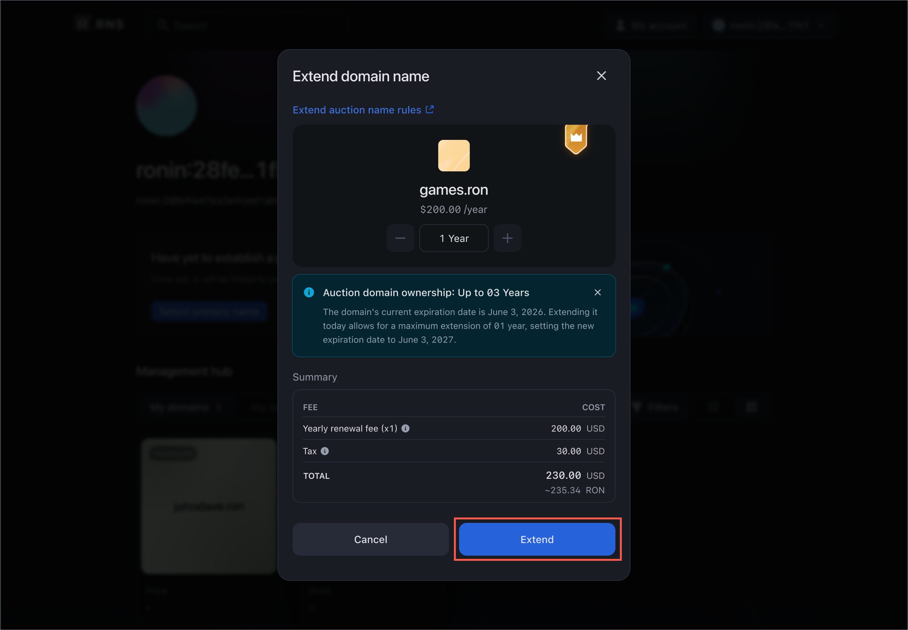
1. Sign the transaction to make payment. Your RNS name registration is successfully extended.

## View your favorite domains

You can add any RNS name to favorites to keep track of its status, for example. To view all your favorite domains, go to the **Favourites** tab.
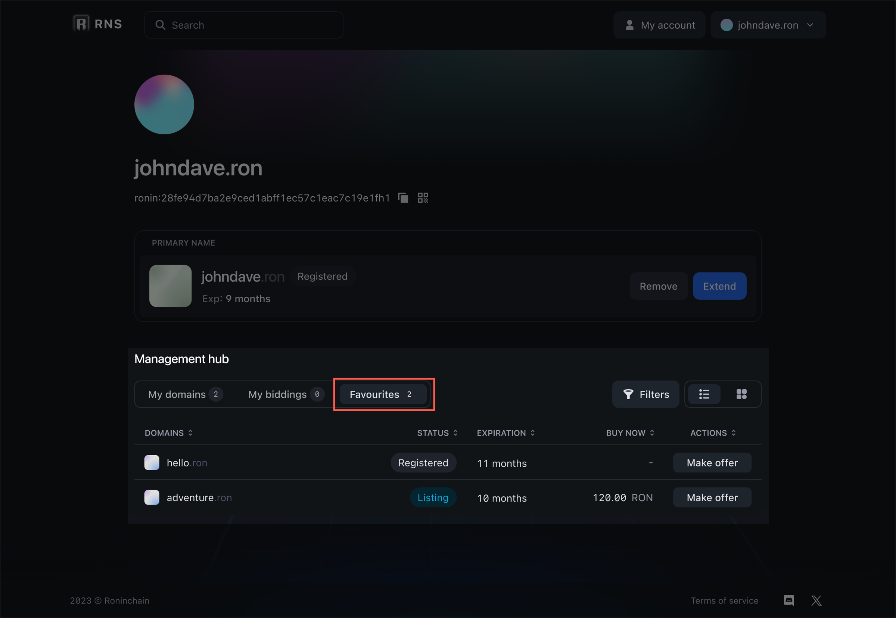

## See also

* [Trade](./trade.md)
