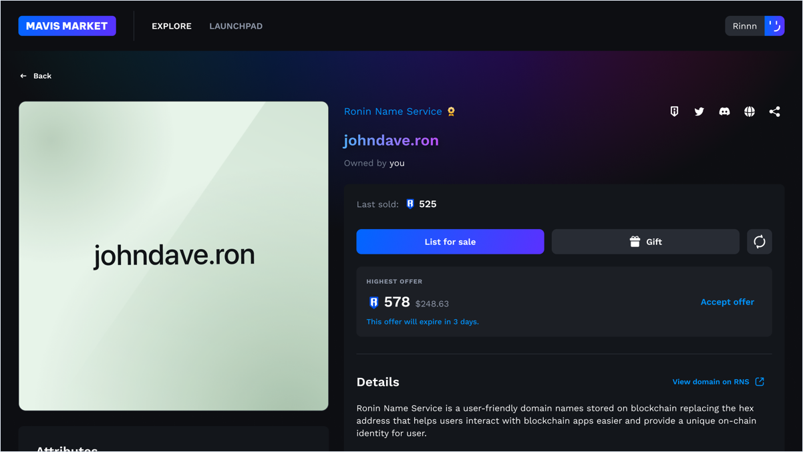
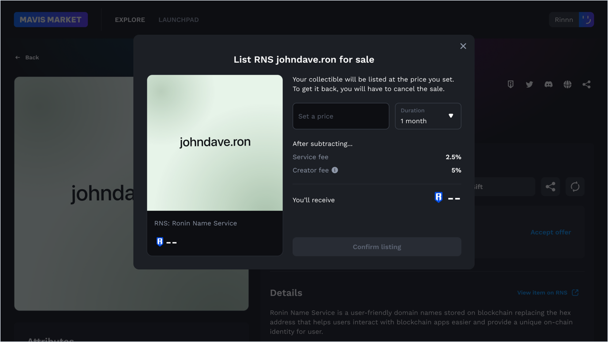
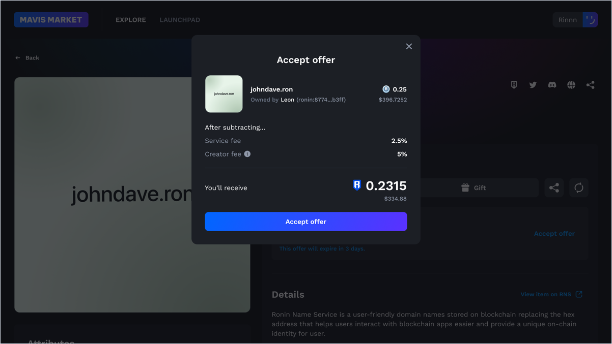

## Overview

This guide demonstrates how to trade RNS names on Mavis Market. You can list your domain name for sale to other users and make offers to buy names from other users.

## Sell

### List for sale on Mavis Market

You can list your domain on Mavis Market at a fixed price. Click **List for sale**, choose the duration of the sale, and set the price.

After you entered the necessary information, click **Confirm listing** to complete your listing.

If the owner listed a domain on Mavis Market and the listed price exceeds the current domain price, then when another user buys the domain, the domain price changes to the listed price, also known as the *last sales price*.

Mavis Market charges a 2.5% commission for a successful sale. For example, if someone buys your domain at a listed price of 100 RON, you receive 97.5 WRON.

### Edit your listing

To make a change to your listing, cancel the existing listing and submit a new one with the updated details.

### Accept an offer

When someone makes a few offers on your listing, you can view the all these offers at once. To accept an offer, click **Accept offer** on the offer you wish to accept. As a reminder, you can only receive payment with WRON, not RON.

## Buy

### Make an offer

Every domain registered for the first time (minted) is searchable on Mavis Market.

If you want to purchase an RNS domain registered by someone else, you can make an offer to the owner. Enter the amount of WETH or WRON (wrapped token) you wish to offer, choose the duration of the offer, and click **Make offer**.

### Cancel an offer

Made an offer, but changed your mind? You can cancel your offer anytime by clicking **Cancel offer**, then **Confirm cancelling**.

## See also

* [Manage](./manage.md)
